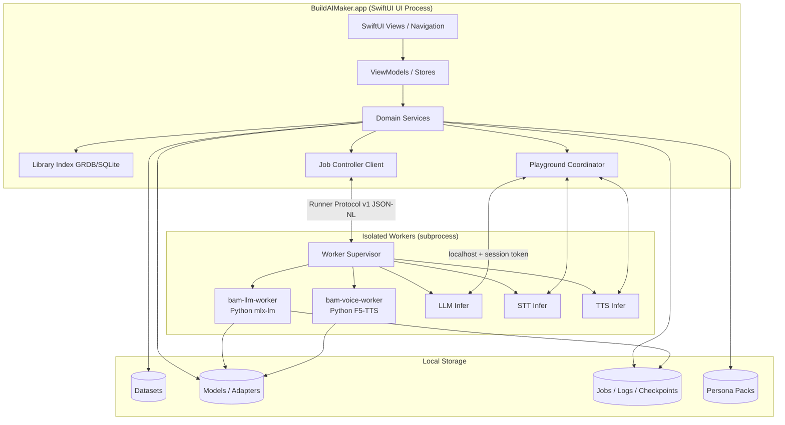
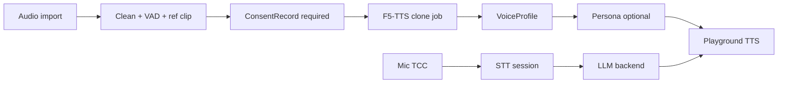
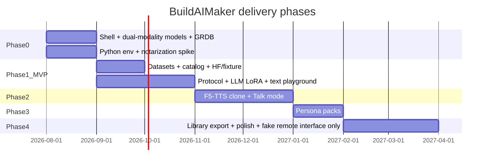

# BuildAIMaker — System Design Document

| Field | Value |
|-------|-------|
| **Document** | BuildAIMaker Architecture & Product Design |
| **Project** | `buildaimaker` (`github-buildaimaker/buildaimaker`) |
| **Author** | Engineering (interim); product owner TBD |
| **Date** | 2026-07-18 |
| **Revised** | 2026-07-19 (founder decisions incorporated) |
| **Status** | Approved for implementation |
| **Audience** | Founders, senior engineers, early implementers |
| **Schema versions pinned here** | `runnerProtocolVersion: 1`, `personaPackFormat: 1`, `librarySchemaVersion: 1` |

---

## Overview

BuildAIMaker is a **native macOS graphical application** for creating, fine-tuning, and composing AI models—starting on Apple Silicon with Swift/SwiftUI. Unlike cloud-only fine-tuning UIs or CLI-first Python toolchains, BuildAIMaker treats **local-first training and dual-modality (text + voice)** as first-class product surfaces.

Users import datasets, pick base models, configure and run fine-tuning jobs, and manage outputs. The differentiating capability is the **persona pack**: a versioned bundle that pairs a fine-tuned LLM personality with a fine-tuned or cloned voice (plus system prompt and conversation settings) so a user can hold a **spoken conversation with a character they created**—e.g. “Talk to Socrates.”

This document specifies architecture, training backends, data/model/job systems, security constraints, phased delivery, and an incremental PR plan for a greenfield repo that today contains only a README.

### MVP success metrics (Phase 1)

| Metric | Pass criterion |
|--------|----------------|
| M1 | User completes one LoRA fine-tune on a bundled or downloaded ≤3B MLX model **without leaving the app / using a terminal** on an M-series Mac with **≥16 GB** unified memory |
| M2 | Job cancel within 15 s of request; interrupted jobs recoverable after force-quit + relaunch |
| M3 | Playground chat loads base + adapter and produces a coherent reply (subjective) in &lt; 30 s cold start on recommended HW |
| M4 | Dataset import rejects malformed JSONL with actionable errors; accepts ShareGPT/OpenAI-messages fixtures in test suite |
| M5 | Zero network calls during train/play except explicit model download |

### 1.0 success metrics (persona era)

| Metric | Pass criterion |
|--------|----------------|
| M6 | User creates a persona with LLM adapter + consent-bound voice and completes one Talk-mode turn (STT→LLM→TTS) |
| M7 | Persona pack zip re-imports on a second machine (same app major version) with license/consent bundle intact |
| M8 | Third-party voice clone blocked without typed attestation; export embeds consent content hash |

### MVP evaluation bar (K25)

Job “done” for MVP = **hold-out validation loss** (when val split exists) + **sample generations** stored on the model card / artifact. No automated style classifiers, MOS listening panels, or full eval harness in 1.0. Richer automated eval is post-1.0.

---

## Background & Motivation

### Current state

- Repository is **greenfield**: `README.md` (“Build AI Maker (native graphical app to create and fine tune models)”) and a standard Xcode `.gitignore`. No application code, packages, or schemas exist yet.
- The broader ecosystem already has strong *pieces*: MLX / mlx-lm for LLM fine-tuning on Apple Silicon, Hugging Face Hub for models/datasets, F5-TTS / MLX-Audio-class stacks for voice, Ollama/LM Studio for inference UX—but no cohesive **native** app that unifies LLM fine-tune + voice + persona + playground with consumer-pro polish.

### Pain points we solve

| Pain | Today | BuildAIMaker |
|------|--------|--------------|
| Fragmented toolchain | Jupyter, CLI, ad-hoc scripts, multiple GUIs | Single native app for dataset → train → evaluate → persona |
| Cloud-only UX | Uploads, costs, privacy friction | Local-first; data stays on device by default |
| Text-only “character” apps | Chatbots without matching voice | Dual modality + persona packs |
| Opaque training | Black-box cloud jobs | Transparent job queue, resource monitors, cancel/resume-from-checkpoint |
| License & ethics gaps | Easy to clone voices without consent | Explicit consent gates, local processing defaults, license metadata |

### Why native macOS first

- Apple Silicon (unified memory + **Metal GPU**) is a strong consumer workstation for **small-to-mid** LoRA fine-tunes and voice cloning. **ANE is not the training path** for MLX LoRA; ANE may appear later for eligible **inference** paths only.
- SwiftUI + AppKit give first-class file access, notarization path, and system integration (Notifications, Menu Bar, Spotlight later).
- Process isolation and signed helpers map cleanly to “GUI shell + heavy trainers” without Electron’s memory tax.

---

## Goals & Non-Goals

### Goals

1. **Native macOS app (SwiftUI)** that covers the full fine-tuning workflow: datasets, base models, job config, run, artifacts, playground.
2. **Local-first training** on Apple Silicon where feasible (LoRA-class LLM adapters; few-shot voice cloning).
3. **Dual modality from the product model day one** (LLM + voice), even if MVP ships LLM-only execution; `Modality` enum, voice `JobSpec`, and persona JSON frozen in PR 2 with fixtures—even when runners are stubs.
4. **Persona packs** as a first-class artifact type: LLM adapter + voice profile + prompts (knowledge packs Phase 2+).
5. **Job system** with queue, progress, cancellation, best-effort resource monitoring, and crash recovery via checkpoints.
6. **In-app playground** for text chat and spoken dialogue against trained artifacts.
7. **Extensible runner abstraction** so Python trainers plug in without rewriting the GUI.
8. **Security-aware design**: notarization, worker trust, consent for voice cloning, license awareness, path validation.
9. **Phased delivery**: MVP → dual-modality training → persona packs → multi-platform readiness.

### Non-Goals (near-term)

1. **Full multi-GPU / cluster training** and enterprise MLOps (Kubeflow, etc.).
2. **Training frontier-scale dense models from scratch** (full FT of large dense models on a laptop).
3. **Windows/Linux native apps in v1** (architecture should *allow* later; not ship them).
4. **Real cloud / remote GPU training in v1** (K22)—ship **local Apple Silicon only**. Keep `RemoteRunner` protocol + **fake remote** (`PR-Remote-Fake`) for interface stability; **no real cloud/SSH pilot until after product-market fit**.
5. **User accounts / login for local features** (K23)—monetize the app; local train/play must work fully offline after purchase and runtime/model downloads.
6. **Marketplace / social sharing of personas in MVP** (export formats only).
7. **Real-time multi-party voice agents**, live phone integration, or telephony.
8. **Replacing research frameworks** (full Lightning/Axolotl feature parity).
9. **iOS/iPad companion** in initial phases (possible later for inference-only personas).
10. **Hard OS-level memory isolation / cgroups** for workers (macOS cannot offer Linux-cgroup parity; v1 is best-effort).
11. **Mid-epoch cooperative pause** (cancel + resume-from-checkpoint only).
12. **Encryption at rest** for library contents in v1 (filesystem permissions + user FileVault only).
13. **Knowledge / RAG packs in 1.0 product** (K26; keys omitted from schema validation until Phase 2+).
14. **Automated eval suite in MVP** (K25)—hold-out loss + sample gens only.

---

## Key Decisions

| # | Decision | Rationale |
|---|----------|-----------|
| K1 | **SwiftUI macOS app shell + Swift Package Manager modular packages** | Greenfield control, notarization path, native UX; SPM keeps modules testable. |
| K2 | **Out-of-process training workers** (supervised subprocesses v1; XPC optional later), never train inside the UI process | Training OOMs and Python crashes must not kill the GUI; enables recovery. |
| K3 | **Primary LLM train stack: Python `mlx-lm` (pinned) under managed venv**, invoked by `bam-llm-worker` entrypoint; LoRA default. QLoRA only if the pinned mlx-lm release documents it for the model family—do not advertise QLoRA generically. | Fastest path to working Mac LoRA; pure Swift MLX reimplementation is optional later (K3b). |
| K3b | **`BAMRunnersMLX` = Swift supervisor + job materializer**, not in-process Swift training in v1 | Names the package clearly: owns IPC to the Python worker, path jail, progress mapping. |
| K4 | **Managed Python environment is an explicit product investment for v1** (venv under Application Support, lockfile per app version, Repair UI). **Accept multi-GB runtime download** with clear progress UI; PR-PyEnv documents size budget. | Required by K3 and voice; spike early (PR-PyEnv). User-provided Python is advanced escape hatch only. |
| K5 | **Local-only training for v1** (Apple Silicon on-device). `RemoteRunner` + **fake remote** kept for interface stability only; **no real cloud until after PMF** (K22). | Privacy default; avoid half-built SaaS; founder decision 2026-07-19. |
| K6 | **Artifacts: LoRA adapters as default export**; optional merge later | Smaller, composable; license obligations documented on cards. |
| K7 | **Voice MVP: few-shot reference cloning only** (not supervised multi-speaker FT in 1.0). Supervised voice FT only after F5 clone + Talk mode are solid (post PR-Talk). | Seconds–minutes of audio; faster persona “wow.” |
| K7b | **Primary voice engine: F5-TTS** via managed Python (MPS/CPU); artifact = engine id + ref WAV hash + engine-specific speaker embedding/cache under `voices/<id>/`. **Fallbacks:** MLX-Audio-class engines when mature for pin; **XTTS-v2 not default** (AGPL / redistribution risk). | Permissive-enough commercial path vs Coqui AGPL; solid English quality on Apple Silicon via PyTorch MPS. License pin verified in PR-VoiceSpike. |
| K8 | **Persona pack = composition layer** with **Pack Format v1 = zip + JSON + relative files** (open, not proprietary) | Portability and inspectability; see Persona resolution + zip layout. |
| K9 | **App-managed library under `~/Library/Application Support/BuildAIMaker/`** + security-scoped bookmarks for external folders | Predictable layout; user data control. |
| K10 | **Target user for v1: creator / prosumer / indie hacker** with **opinionated presets + Advanced panel** for power users (confirmed founder 2026-07-19). Not a pure research MLOps surface. | Matches product vision; keeps wizard-first UX without blocking power users. |
| K11 | **Voice cloning requires `ConsentRecord` bound by id + content hash into every voice profile and export** | Gate alone is insufficient; see Consent design. |
| K12 | **MVP = LLM fine-tune + playground; voice + persona architecture frozen early, execution phased** | Ship value without text-only calcification (fixtures in PR 2). |
| K13 | **Persistence: GRDB** (SQLite) for `library.sqlite` | Mature, typed, migration-friendly on Apple platforms; no spike needed vs SQLiteData. |
| K14 | **Distribution v1: Developer ID + notarization (direct download)**; **App Store deferred** (still planned later, not v1). | Avoids sandbox fights with managed Python + trainers. |
| K15 | **First catalog family: Qwen2.5 Instruct (0.5B / 1.5B / 3B) MLX community builds**, plus one tiny **bundled fixture** for CI/dogfood offline. **Llama-3.x as second family only after Qwen2.5 path is stable** (post PR-LLM-LoRA dogfood). | Strong MLX availability; chat template registry starts with Qwen2.5 + generic ChatML. |
| K16 | **Minimum supported RAM: 16 GB unified memory**; 8 GB not supported | Aligns hardware table, estimator refuse thresholds, and support burden. |
| K17 | **Inference: composable backends** (separate LLM / STT / TTS processes or lazy modules), not one mega-server required; optional thin localhost gateway | Memory unload per backend; avoid monolithic always-resident stack. |
| K18 | **Resource limits: best-effort only** (preflight refuse, RSS soft-cancel, path canonicalize)—no cgroup/chroot claims | Honest macOS constraints. |
| K19 | **IDs: UUID v4 for all library entities**; model **catalog keys** also store `sourceKey` (e.g. HF repo id) + `contentHash` when available | Stable local refs; reproducible downloads. |
| K20 | **Blocked voice/persona categories (v1 interim policy):** non-consensual third parties; sexual content involving minors (zero tolerance); no curated “celebrity clone” catalog. **No additional blocked categories for v1 marketing** unless dogfood surfaces a need. Founder may extend list in Settings JSON later. | Interim default; founder confirmed 2026-07-19. |
| K21 | **Two-layer worker trust:** L1 TeamID `SecCode` only on bundle `Helpers/bam-*-worker`; L2 managed Python via lockfile + entry module hashes (`runtime-pins.json`). TeamID never applied to venv/CPython. | Reconciles post-install wheels with notarization; implementable integrity without lying about signing. |
| K22 | **Cloud policy v1: local-only.** Real remote/cloud training is explicitly post-PMF. Keep protocol + fake remote only. | Founder decision 2026-07-19; protects scope and privacy story. |
| K23 | **Commercial model: paid app** (one-time purchase and/or subscription—exact SKU TBD at launch). **No accounts required for local features.** License/entitlement check may use platform commerce (e.g. direct license key or future App Store) without a BuildAIMaker account system for train/play. | Monetize the product itself; local-first UX without login walls. |
| K24 | **OSS license compliance for paid distribution:** shipping a paid app does **not** waive obligations of pinned OSS (mlx-lm, F5-TTS, MLX, etc.). ADRs must record SPDX of each pin; redistribution/source obligations reviewed with counsel before public paid launch. **Not legal advice—flag for counsel.** | Paid + open-source deps is a compliance project, not an afterthought. |
| K25 | **MVP evaluation depth: hold-out loss + sample generations** on artifacts/model cards. Automated eval suite (style metrics, listening tests, etc.) is **later**, not 1.0. | Founder decision 2026-07-19; enough signal for creator MVP. |
| K26 | **Knowledge / RAG packs: Phase 2+ only.** Omit from 1.0 schema validation (ignore unknown keys; no product UI). | Founder decision 2026-07-19; matches Non-Goal #13. |

---

## Proposed Design

### High-level architecture



### Module map (SPM packages)

```text
buildaimaker/
├── Apps/
│   └── BuildAIMaker/
├── Packages/
│   ├── BAMCore/                 # IDs, errors, config, paths, FeatureFlags, protocol version constants
│   ├── BAMModels/               # Codable domain models (dual-modality from day one)
│   ├── BAMPersistence/          # GRDB, migrations, file layout, bookmarks
│   ├── BAMDatasets/
│   ├── BAMModelCatalog/
│   ├── BAMJobs/
│   ├── BAMRunners/              # TrainingRunner protocol + process supervisor + path jail
│   ├── BAMRunnersMLX/           # LLM job materializer + mlx-lm worker client (not in-process train)
│   ├── BAMRunnersVoice/         # F5-TTS worker client
│   ├── BAMInference/            # Composable LLM/STT/TTS backend clients
│   ├── BAMPersonas/             # Resolution algorithm + pack import/export
│   ├── BAMConsent/              # ConsentRecord create/validate/hash
│   └── BAMResourcesUI/
├── Workers/
│   ├── bam-llm-worker/          # Python entry + thin argv wrapper if needed
│   ├── bam-voice-worker/
│   └── fixtures/                # tiny model + sample JSONL + protocol golden JSONL
├── Docs/
│   ├── design.md                # this document (or link)
│   └── adr/                     # ADRs for engine/runtime pins
└── Catalog/
    └── models.json              # living supported model list
```

**Dependency rule:** UI → domain packages → runners; runners never import SwiftUI.

**Naming note:** `BAMRunnersMLX` means “MLX ecosystem train path,” implemented as **Python mlx-lm under supervisor**, not Swift MLX training in v1.

### Process & isolation model

```mermaid
sequenceDiagram
  participant UI as UI Process
  participant Sup as Worker Supervisor
  participant Run as Training Runner
  participant FS as Filesystem

  UI->>Sup: StartJob(jobSpec)
  Sup->>FS: Create job dir, lock, write jobspec.json
  Sup->>Run: spawn worker --job-dir PATH
  Run->>Sup: hello (protocol negotiate)
  Sup->>Run: prepare / run commands on stdin
  loop Progress
    Run-->>Sup: event lines (progress, log, heartbeat)
    Sup-->>UI: JobProgress
  end
  alt Success
    Run->>FS: Write artifacts
    Run-->>Sup: result succeeded
    Sup-->>UI: terminal state
  else Cancel / Crash
    UI->>Sup: CancelJob
    Sup->>FS: write cancel.flag
    Note over Sup,Run: grace T1 for cooperative exit
    Sup->>Run: SIGTERM then SIGKILL after T2
    Sup->>FS: Mark interrupted; keep checkpoints
    Sup-->>UI: cancelled / failed recoverable
  end
```

Workers run under the user account with **cwd = job directory**. Env pins `BAM_LIBRARY_ROOT`, `BAM_MODEL_CACHE`, `BAM_REDACT_SAMPLES=1`.

---

### Dual-modality type model (frozen early)

Two deliberate enums—**do not merge** them. Jobs describe *work to run*; datasets describe *data kind on disk*.

```swift
/// What a training/infer job does (Runner Protocol / jobs table).
public enum JobModality: String, Codable, Sendable {
    case llm
    case voiceClone
    case voiceFinetune   // Phase 2+; schema reserved, runner may return capability unsupported
}

/// What a dataset contains (datasets table only).
public enum DatasetModality: String, Codable, Sendable {
    case text    // chat JSONL, prompt-completion, etc.
    case audio   // WAV/FLAC/M4A corpora or clone reference sets
}

public enum JobStatus: String, Codable, Sendable {
    case draft, queued, preparing, running
    case succeeded, failed, cancelled, interrupted
    // no pausing in v1
}

// Backward-compat alias used in prose: Modality == JobModality
public typealias Modality = JobModality
```

**Mapping (dataset → eligible jobs):**

| `DatasetModality` | Eligible `JobModality` values |
|-------------------|-------------------------------|
| `text` | `llm` |
| `audio` | `voiceClone`, `voiceFinetune` (Phase 2+) |

Fixtures in PR-Domain **must** include sample `JobSpec` JSON for `llm` and `voiceClone` even if only the fake runner accepts them, plus one `DatasetModality.audio` fixture.

---

### Dataset pipeline

**Supported formats (phased):**

| Phase | LLM / text | Voice / audio |
|-------|------------|---------------|
| MVP | JSONL chat (`messages[]`), Alpaca/ShareGPT converters, prompt-completion | WAV/FLAC/M4A + optional JSONL metadata (path, transcript) for clone refs |
| Later | Parquet, HF datasets loaders | LJSpeech-style, Common Voice, diarized multi-speaker |

**Pipeline stages:** Import → Validate → Preview → Normalize → Split → Privacy controls.

**Chat template policy:** store **canonical messages**; apply model-specific templates at **job materialization** via `ChatTemplateRegistry` (initial entries: `qwen2.5-instruct`, `chatml-generic`).

**Copy vs reference:**

| Mode | Behavior |
|------|----------|
| **Copy** (default for small) | Files duplicated under `datasets/<id>/`; delete = recursive remove of app copy (best-effort overwrite-with-zeros **not** guaranteed; v1 uses normal `FileManager.removeItem`; document residual forensic risk) |
| **Reference** | Security-scoped bookmark; if target missing → dataset status `unavailable`; user can relink |

**Spotlight:** set `URLResourceKey.isExcludedFromBackupKey` where applicable; apply `com.apple.metadata:kMDItemAttributeChangeDate` / exclude via `URLResourceValues.isExcludedFromBackup` and document that full Spotlight exclusion may require putting library under non-indexed paths—v1 sets `NSURLIsExcludedFromBackupKey` and relies on Application Support defaults.

---

### Model catalog

- **Local discovery:** scan for MLX/HF layouts; parse `config.json` / `adapter_config.json`.
- **Living catalog file:** `Catalog/models.json` lists supported HF/MLX ids, param counts, quant, min RAM GB, template id, license SPDX.
- **Default family (K15):** Qwen2.5 Instruct 0.5B/1.5B/3B MLX builds.
- **Bundled fixture:** tiny randomly-initialized or micro model under `Workers/fixtures/models/tiny-qwen-mlx/` for offline CI (not quality; protocol/job plumbing only).
- **Download:** HF Hub with token in Keychain; resume via partial files + etag when tooling allows.
- **License:** persist SPDX/`license` string; warn on export.

---

### Job system

**State machine (v1 — no pause):**

```text
draft → queued → preparing → running → succeeded
                              ↓
                     failed | cancelled | interrupted
interrupted → queued   (resume if checkpoint present and runner supports resume)
```

**Capabilities:**

- Concurrency: **1 training job**; inference backends may run with soft memory guard (unload on train start).
- Progress: step, epoch, loss, lr, tokens/sec, ETA, **Metal/GPU util where available**, CPU%, RSS from heartbeat (not ANE for training).
- **Cancel:** write `$JOB_DIR/cancel.flag` → wait `T1=10s` → SIGTERM → wait `T2=5s` → SIGKILL.
- **Crash recovery:** `job.json`, `events.jsonl`, `checkpoints/`, `heartbeat.json` (mtime + pid); stale heartbeat on launch → `interrupted`.
- **Resume:** supervisor sends `{"cmd":"resume",...}` only if `checkpoints/latest` exists and worker hello advertises `caps.resume == true`; else re-queue as fresh run from last materialization (user confirm).

#### Resource policy (best-effort — K18)

| Control | v1 mechanism | Not claimed |
|---------|--------------|-------------|
| Memory ceiling | Preflight estimator refuse if `peakEstimate > available - osReserve`; optional soft-cancel if heartbeat RSS &gt; ceiling × 1.1 for N samples | No cgroup, no jetsam subscription guarantee, no Metal hard cap |
| Batch/rank suggest | Table-driven heuristic (see Hardware Fit) | Not optimal search |
| Path jail | Canonicalize all job paths under `libraryRoot` or job dir; reject `..` and symlink escape after `resolvingSymlinksInPath` | No chroot/seatbelt profile in v1 Developer ID build |
| CPU priority | Optional `Process.qualityOfService = .utility` | No real-time isolation |

---

### Hardware Fit estimator v0 (approximate)

**Inputs:** `paramCountB`, `quantBits` (4/8/16), `loraRank`, `maxSeqLen`, `batchSize`, `gradAccum`, `osReserveGB` (default 6), `availableUnifiedGB`.

**Heuristic (LLM LoRA peak GB, rough):**

```text
baseBytes   ≈ paramCountB * 1e9 * (quantBits/8)
loraBytes   ≈ paramCountB * 1e9 * (loraRank / 16) * 0.02   // coarse; clamp ≥ 0.05 GB
optimBytes  ≈ loraBytes * 2                                // Adam-ish on trainable
activFudge  ≈ (maxSeqLen/2048) * batchSize * gradAccum * 0.5 * paramCountB
peakGB      ≈ (baseBytes + loraBytes + optimBytes) / 1e9 + activFudge + 1.5
```

**Actions:**

| Condition | UI |
|-----------|-----|
| `peakGB + osReserveGB > availableUnifiedGB` | **Refuse to start** with suggestions: lower rank (16→8), seq (2048→1024), batch=1, smaller base |
| within 15% of limit | Warning, allow override (advanced) |
| OK | Green fit |

Label UI copy: **“Approximate — based on model size class, not a profiled run.”**

**Global hardware gate (K16):** any train feature (LLM LoRA or voice clone) **refuses** if `availableUnifiedGB < 16`. There is no separate 12 GB voice threshold on supported machines—that branch is dead under K16.

**Voice clone preflight (on already-supported ≥16 GB hosts):** use the same soft warning band as LLM when free memory is tight after OS reserve (e.g. free &lt; 8 GB usable) → warn “close other apps”; no alternate minimum below 16 GB. Diagnostic builds may log `availableUnifiedGB` for unsupported &lt;16 GB devices but product UI already blocks train entry.

---

### Training backends

| Workload | v1 backend | Notes |
|----------|------------|-------|
| LLM LoRA | **Python mlx-lm** pinned in managed env via `bam-llm-worker` | Materialize HF/MLX paths + JSONL; call documented mlx-lm fine-tune CLI/API |
| LLM full FT | Unsupported | Cloud/remote later |
| LLM infer | MLX generate process or mlx-lm server | Composable backend |
| Voice clone | **F5-TTS** primary | Ref audio 5–60 s clean speech recommended |
| Voice FT | Unsupported in 1.0 | |
| STT | whisper.cpp or MLX-Whisper | Talk mode |
| TTS (persona) | F5-TTS synthesize with stored voice profile | Streaming if engine allows; else chunk |

**Managed Python packaging:**

- Location: `.../BuildAIMaker/envs/python/<appVersion>/`
- Lockfile: `Workers/python/uv.lock` or `requirements.lock` owned by repo; app version must match lock generation.
- Install: first-run or Settings → “Install training runtime” with **clear multi-GB progress UI** (size budget documented in PR-PyEnv; multi-GB is accepted).
- Repair: delete env + reinstall from lock.
- **Notarization:** prefer **post-install download** of wheels into Application Support (not inside the notarized `.app`) to simplify signature surface.
- **Integrity pins (embedded in app Resources):** `runtime-pins.json` containing lockfile SHA-256, expected interpreter relative path, and SHA-256 of worker entry modules (`llm_worker/main.py`, `voice_worker/main.py`). Written at build time from the same lock used in CI.
- **License inventory:** PR-PyEnv / PR-VoiceSpike record SPDX for every pinned package (feeds K24 counsel review).

#### Two-layer worker trust model (required)

Post-install CPython and site-packages are **not** signed with the app TeamID. Trust is **not** “TeamID on everything.”

| Layer | What | Verification |
|-------|------|----------------|
| **L1 — Process entry** | Thin native helpers shipped in the app bundle: `Contents/Helpers/bam-llm-worker`, `Contents/Helpers/bam-voice-worker` (and optional `bam-infer-*`) | Before spawn: **`SecCode` TeamID must match the main app**. These helpers are the **only** binaries the UI/supervisor launches. |
| **L2 — Managed runtime** | venv interpreter + wheels under Application Support | Helper, **after** L1, verifies: (1) `runtime-pins.json` lockfile hash matches on-disk lock, (2) interpreter path is under the managed env root for this `appVersion` (allowlist; no arbitrary `python3` on `$PATH`), (3) entry module hashes match pins, (4) optional: wheel RECORD digests when installing. **TeamID is not applied to CPython or `.so` dylibs.** |

```text
UI/Supervisor
  → spawn only Helpers/bam-*-worker   # L1 TeamID SecCode
      → helper validates runtime-pins # L2 hash/pin
      → exec managed python -m …      # never exec unsigned path from UI
```

If L2 fails → surface `BAM_RUNTIME_INTEGRITY` and Settings → “Repair training runtime” (do not fall back to system Python).

**Residual risk (accepted v1):** a same-user attacker who can write Application Support can replace wheels after install until next pin check; Repair re-downloads from pinned URLs. Threat model is casual misuse / supply chain at install time, not hostile same-UID malware.

---

### Output artifacts

| Kind | Contents |
|------|----------|
| `lora_adapter` | weights + `adapter_config.json` + metrics + `model_card.md` |
| `voice_profile` | `profile.json` (engine, paths, `consentRecordId`, `consentContentHash`) + `reference.wav` + engine cache |
| `persona_pack` | Pack Format v1 zip (below) |
| `model_card` | data summary, hyperparams, license, sample gens |

---

### Voice path



#### Talk mode sequence

```mermaid
sequenceDiagram
  participant U as User
  participant UI as Playground
  participant TCC as macOS TCC
  participant STT as STT Backend
  participant LLM as LLM Backend
  participant TTS as TTS Backend

  U->>UI: Start Talk mode
  UI->>TCC: request Microphone if needed
  alt Denied
    UI-->>U: Permission error + Settings deep link
  end
  U->>UI: Push-to-talk down
  UI->>STT: startStreamingSession(lang)
  STT-->>UI: partial transcripts
  U->>UI: release
  UI->>STT: finalize
  STT-->>UI: final text
  UI->>LLM: chat(messages + persona system)
  LLM-->>UI: tokens (stream if available)
  UI->>TTS: synthesize(text, voiceProfile)
  TTS-->>UI: audio PCM/file
  UI-->>U: playback
  Note over UI: Barge-in v1: stop TTS on new PTT; no full duplex cancel of LLM mid-gen required
```

**Latency targets remain aspirational;** measurement harness owned by `BAMInference` Diagnostics (record stage timestamps to job-less `playground_trace.json`).

---

### Persona composition

#### Source of truth

- **On disk / export:** nested `persona.json` (Pack Format v1).
- **In SQLite:** `personas` row + optional normalized `persona_components` for query only; export always rebuilds nested JSON from resolution algorithm. **JSON manifest is canonical for packs.**

#### Partial personas

| Components | Allowed? | Playground |
|------------|----------|------------|
| LLM only (base and/or adapter) | Yes | Text mode; Talk mode disabled or TTS uses system voice with banner |
| Voice only | Yes (preview voice) | TTS sample only; no chat |
| LLM + voice | Yes | Text + Talk |
| Missing base but adapter present | Invalid until base resolved | Error |

#### Resolution algorithm

```text
function resolvePersona(personaId, library):
  p = loadPersonaRow(personaId)
  errors = []          # fatal
  warnings = []
  base = null
  adapter = null
  voice = null
  mode = null          # .full | .textOnly | .voicePreview

  hasLLM = p.llm.adapterArtifactId != null || p.llm.baseModelId != null
  hasVoice = p.voice.voiceProfileId != null

  if not hasLLM and not hasVoice:
    errors.add(EMPTY_PERSONA)   # fatal
    throw PersonaUnresolved(errors)

  # --- LLM branch ---
  if hasLLM:
    if p.llm.adapterArtifactId:
      adapter = library.artifact(p.llm.adapterArtifactId)
      if not adapter: errors.add(MISSING_ADAPTER)
      else if adapter.baseModelId != p.llm.baseModelId:
        errors.add(ADAPTER_BASE_MISMATCH)
      base = library.model(p.llm.baseModelId)
      if not base: errors.add(MISSING_BASE)
    else:
      base = library.model(p.llm.baseModelId)
      if not base: errors.add(MISSING_BASE)
  # else: voice-only — do NOT add NO_LLM

  # --- Voice branch ---
  if hasVoice:
    voice = library.voiceProfile(p.voice.voiceProfileId)
    if not voice: errors.add(MISSING_VOICE)
    else if not verifyConsentHash(voice): errors.add(CONSENT_TAMPER)

  if errors.nonEmpty: throw PersonaUnresolved(errors)

  if hasLLM and hasVoice: mode = .full
  else if hasLLM:         mode = .textOnly
  else:                   mode = .voicePreview   # hasVoice only
      warnings.add(VOICE_PREVIEW_NO_LLM)

  # Knowledge: ignore unknown keys; if knowledgePackId present in v1 → warnings.add(IGNORED_KNOWLEDGE)

  return ResolvedPersona(mode, base, adapter, voice, systemPrompt, sampling, warnings)
```

**Playground routing from `mode`:** `.full` → Text + Talk; `.textOnly` → Text (Talk disabled or system-voice banner); `.voicePreview` → TTS sample only, chat disabled.

#### Versioning

- Persona has semver `version`.
- Changing adapter, voice, or system prompt in the editor creates a **new draft** and recommends bump (patch for sampling, minor for prompt/voice, major for different base model)—enforced as UI suggestion, not git-like auto.
- **Published snapshot** (export) is immutable: pack embeds files, not live DB ids alone.

#### Pack Format v1 zip layout

```text
socrates-1.0.0.bam.persona.zip
├── manifest.json          # formatVersion=1, persona metadata, component digests
├── persona.json           # nested composition (relative paths, not absolute host paths)
├── licenses/
│   ├── base_model.txt
│   └── voice_engine.txt
├── consent/
│   └── consent.json       # full ConsentRecord + contentHash
├── llm/
│   ├── adapter/           # optional LoRA files
│   └── base_ref.json      # sourceKey + expected contentHash (base weights optional omit for size)
├── voice/
│   ├── profile.json
│   ├── reference.wav
│   └── engine/            # engine cache if redistributable under engine license
└── samples/
    └── hello.wav          # optional preview
```

`manifest.json` includes SHA-256 of each file. Import verifies hashes + consent hash binding.

**Open vs proprietary:** v1 is **open zip+JSON** (K8). No encryption.

---

### Consent design (complete for v1 implementation)

#### `ConsentRecord` schema

```json
{
  "id": "uuid",
  "schemaVersion": 1,
  "createdAt": "ISO-8601",
  "subjectType": "self" | "third_party" | "synthetic_or_public_domain",
  "subjectDisplayName": "string",
  "attestorUserLabel": "string",
  "scope": "personal_use" | "shareable_export" | "research_only",
  "statements": [
    "I have the right to use this voice for the selected scope.",
    "I will not use this to commit fraud or illegal impersonation."
  ],
  "attestedAt": "ISO-8601",
  "appVersion": "string",
  "jurisdictionNote": "optional free text",
  "retention": "until_user_deletes",
  "contentHash": "<sha256 hex; see canonicalization below>"
}
```

#### `contentHash` canonicalization (normative — v1)

Stable across Swift and any future Python tooling. **Not** full RFC 8785 JCS (avoid float edge cases); fixed field set + deterministic JSON.

1. **Hash input object** = all fields of `ConsentRecord` **except** `contentHash`.
2. **Allowed keys only** (reject unknown keys before hash):  
   `id`, `schemaVersion`, `createdAt`, `subjectType`, `subjectDisplayName`, `attestorUserLabel`, `scope`, `statements`, `attestedAt`, `appVersion`, `jurisdictionNote`, `retention`.
3. **Types:** strings and ints only in hashed form; `schemaVersion` is integer; `statements` is array of strings in **given order** (do not sort array elements—order is semantic).
4. **Missing optional fields:** omit key entirely (`jurisdictionNote` if empty/nil). Do not emit `null`.
5. **Serialize** as UTF-8 JSON with:
   - object keys **sorted lexicographically by Unicode code point**
   - **no** insignificant whitespace (no space after `:` or `,`)
   - no trailing newlines
   - JSON string escaping per RFC 8259 (Swift `JSONEncoder` with sorted keys + `.withoutEscapingSlashes` off for max interop—document: use a shared test vector, not ad-hoc encoders)
6. **`contentHash` value** = lowercase hex SHA-256 of those UTF-8 bytes, with optional stored form `sha256:<hex>` on disk; comparisons normalize by stripping a `sha256:` prefix.
7. **Golden fixture** in PR-Domain / PR-Consent: fixed record → exact hash string (CI fails on encoder drift).

Example serialization fragment (illustrative key order after sort):

```text
{"appVersion":"0.1.0","attestedAt":"2026-07-18T12:00:00Z",...}
```

**Rules:**

1. Every `voice_profile` **must** have `consentRecordId` + stored `consentContentHash` computed as above.
2. `subjectType == third_party` requires non-empty `subjectDisplayName` and explicit secondary checkbox; default UI path is **self**.
3. Export with `scope == personal_use` → pack flagged `exportAllowed: false` for share UX (user can still filesystem-copy; app Share sheet blocks with explanation). `shareable_export` required for Share/export wizards.
4. Clone job refuses start without valid consent row matching hash.
5. **Product does not provide legal advice or guarantee** compliance with all jurisdictions; UI disclaimer on first voice use.
6. Mic/dataset retention: reference audio kept with voice profile until user deletes profile; training temps under job dir deleted on successful job cleanup (Settings: “Keep job dir”).

---

### Inference playground

- **Text mode:** chat, system override, adapter on/off A/B (single adapter v1; multi-adapter non-goal).
- **Talk mode:** sequence above; TCC failure modes surfaced.
- **Backends (K17):** `LLMBackend`, `STTBackend`, `TTSBackend` protocols; supervisor starts only what is needed.
- **Localhost gateway (optional):** `127.0.0.1` random port; session token in Keychain memory / ephemeral file mode 0600; lifetime = playground session; integration test asserts non-`0.0.0.0` bind.
- **Idle unload:** stop backends after N minutes (default 15) or when training starts.
- **Not using Ollama/LM Studio as required dependency** (see Alternatives); optional later import of GGUF paths.

---

### Security, sandboxing, notarization

| Topic | Approach |
|-------|----------|
| **Distribution** | Developer ID + notarization (K14) |
| **Sandbox** | Non-App-Sandbox v1; security-scoped bookmarks for user folders |
| **Subprocesses** | **Two-layer trust** (see Managed Python): spawn **only** TeamID-signed `Contents/Helpers/bam-*-worker`; helpers exec managed Python after **lockfile + entry hash** pins. Never TeamID-check the venv interpreter. |
| **Secrets** | HF tokens Keychain; never log |
| **Network** | Explicit downloads only |
| **Encryption at rest** | **None in v1** (residual risk; FileVault recommended in docs) |
| **Voice consent** | K11 + Consent schema + canonical contentHash |
| **Blocked categories** | K20 |

#### Security controls matrix

| Control | v1 mechanism | Residual risk |
|---------|--------------|---------------|
| Path traversal in job specs | Resolve symlinks; `assertUnderRoot` on **all** absolute paths in `JobPaths` **and** `JobSpec` (see rule below) | TOCTOU races low severity |
| Malicious trainer code | No `trust_remote_code` by default; pin packages via lockfile hash | Compromised wheel at download time; mitigated by URL allowlist + hash |
| Worker entry trust (L1) | `SecCode` TeamID on `Helpers/bam-*-worker` only | Helper bug could exec wrong path—keep helper minimal |
| Managed Python integrity (L2) | `runtime-pins.json`: lockfile SHA-256, interpreter under env root, entry module hashes | Same-UID rewrite of Application Support until next check; Repair reinstalls |
| Localhost infer hijack | `127.0.0.1` + random port + bearer token | Same-user malware |
| Dataset leakage in logs | `BAM_REDACT_SAMPLES=1`; workers must not print full samples at info level | Worker bugs |
| Voice at rest | FS permissions only | Stolen disk without FileVault |
| Consent tamper | Canonical contentHash in profile + pack | User with FS write can forge—threat is casual misuse not APT |
| Secure delete | Normal unlink | Forensic recovery possible |

#### Path validation algorithm

```text
func assertUnderRoot(userPath, root):
  rootReal = root.resolvingSymlinksInPath().standardizedFileURL.path
  pathReal = userPath.resolvingSymlinksInPath().standardizedFileURL.path
  guard pathReal == rootReal || pathReal.hasPrefix(rootReal + "/") else { throw PATH_ESCAPE }

func assertJobPathsSafe(paths: JobPaths, spec: JobSpec):
  allowedRoots = [paths.libraryRoot, paths.jobDir]
  # every JobPaths file field must be under libraryRoot or equal jobDir subtree
  for each absolute path field P in paths:
    assert under libraryRoot OR under jobDir
  # any absolute path embedded in JobSpec must also be jailed
  for each absolute path field P in spec (recursive string scan of known path keys):
    assertUnderRoot(P, paths.libraryRoot) OR assertUnderRoot(P, paths.jobDir)
    # and P should equal the corresponding JobPaths field when one exists
```

**Normative path rule:** Before `prepare` / `run` / `resume`, the supervisor jail-checks **every absolute path in `JobPaths` and in `JobSpec`**. Preferred shape: put filesystem inputs only on `JobPaths` (e.g. `referenceAudioPath`); if a path remains on `JobSpec` for readability, it **must** be identical to the `JobPaths` field after standardization or the job is rejected (`BAM_PATH_ESCAPE`).

Job-allowed roots: `libraryRoot`, `jobDir`, and read-only inputs listed on `JobPaths` (`datasetPath`, `baseModelPath`, `referenceAudioPath`, …).

---

### Hardware requirements

| Tier | Machine | Supported workloads |
|------|---------|---------------------|
| **Minimum (supported)** | Apple Silicon, **16 GB** unified | ≤1.5–3B LoRA (tight), voice clone, light playground |
| **Recommended** | M-series Pro, 18–36 GB | 3–8B LoRA class when catalog lists them, comfortable Talk mode |
| **Comfortable** | Max/Ultra, 64 GB+ | Larger ranks, longer context |
| **Not supported** | Intel Mac; **&lt; 16 GB** unified | Block install messaging / refuse train with clear error |

---

## API / Interface Changes

### Error taxonomy (sketch — expand in PR 2)

| Code | Domain | Meaning |
|------|--------|---------|
| `BAM_PATH_ESCAPE` | security | Path failed jail check |
| `BAM_RUNTIME_INTEGRITY` | security | Managed Python pin/lock/entry hash mismatch |
| `BAM_PROTOCOL_MISMATCH` | runner | Worker hello version incompatible |
| `BAM_EMPTY_PERSONA` | persona | Neither LLM nor voice components |
| `BAM_WORKER_CRASH` | runner | Non-zero exit / invalid JSON |
| `BAM_WORKER_HUNG` | runner | Heartbeat timeout |
| `BAM_CANCELLED` | job | User cancel |
| `BAM_OOM_SOFT` | job | Soft memory cancel |
| `BAM_PREFLIGHT_MEMORY` | job | Estimator refuse |
| `BAM_DATASET_INVALID` | data | Schema validation failed |
| `BAM_MODEL_NOT_FOUND` | catalog | Missing base/adapter |
| `BAM_CONSENT_REQUIRED` | voice | Missing/invalid consent |
| `BAM_CONSENT_TAMPER` | voice | Hash mismatch |
| `BAM_PERSONA_UNRESOLVED` | persona | Resolution errors |
| `BAM_TCC_MIC_DENIED` | infer | Microphone permission |
| `BAM_CAPABILITY_UNSUPPORTED` | runner | e.g. voiceFinetune on v1 worker |
| `BAM_LICENSE_BLOCK` | export | License prevents operation |

### `TrainingRunner` protocol (aligned 1:1 with wire protocol)

```swift
public protocol TrainingRunner: Sendable {
    var id: String { get }
    var protocolVersion: Int { get }  // 1

    func capabilities() async throws -> RunnerCapabilities
    func prepare(job: JobSpec, paths: JobPaths) async throws
    func run(job: JobSpec, paths: JobPaths) -> AsyncThrowingStream<RunnerEvent, Error>
    func resume(job: JobSpec, paths: JobPaths, checkpoint: CheckpointRef)
        -> AsyncThrowingStream<RunnerEvent, Error>
    func cancel(jobId: UUID) async
}

public struct RunnerCapabilities: Codable, Sendable {
    public var modalities: Set<Modality>
    public var resume: Bool
    public var modelFamilies: [String]      // e.g. ["qwen2.5", "llama3"]
    public var maxSeqLen: Int?
    public var engineIds: [String]?         // voice
}
```

---

## Runner Protocol v1 (implementable)

### Transport

| Rule | Value |
|------|--------|
| Framing | **UTF-8 newline-delimited JSON** (NDJSON); one message per line |
| Max line size | **8 MiB**; exceed → worker fatal, supervisor `BAM_WORKER_CRASH` |
| Partial lines | Supervisor buffer until `\n`; discard incomplete on process exit |
| Stdout | **Only** protocol messages |
| Stderr | Human logs; supervisor tees to `logs/worker.stderr.log` (not parsed as protocol) |
| Stdin | Commands from supervisor |
| cwd | `jobDir` |
| Heartbeat | Worker emits `heartbeat` ≥ every **5 s** while running; supervisor timeout **20 s** → hung |
| Hello deadline | First `hello` within **30 s** of spawn or kill |

### Process lifecycle

```text
spawn → hello/hello_ok → (prepare)? → run|resume → events… → result → exit 0
                         ↘ error event → exit non-zero
cancel.flag or cmd cancel → cooperative stop → result cancelled → exit 0
```

### Exit codes

| Code | Meaning |
|------|---------|
| 0 | Clean protocol completion (incl. cancelled result) |
| 1 | Handled failure (error event already sent) |
| 2 | Protocol/usage error |
| 130 | SIGTERM path |
| 137 | SIGKILL / OOM killer suspected |
| other | Unexpected; supervisor maps `BAM_WORKER_CRASH` |

### Message catalog

**Worker → Supervisor**

```json
{"v":1,"type":"hello","workerId":"bam-llm-worker","workerVersion":"0.1.0","caps":{"modalities":["llm"],"resume":true,"modelFamilies":["qwen2.5"],"maxSeqLen":8192}}

{"v":1,"type":"log","level":"info","message":"loading model","ts":"ISO-8601"}

{"v":1,"type":"progress","step":12,"epoch":0.4,"loss":1.02,"lr":0.0001,"tokensPerSec":120.5,"etaSec":600,"metrics":{}}

{"v":1,"type":"checkpoint","path":"checkpoints/step-100","step":100}

{"v":1,"type":"artifact","kind":"lora_adapter","path":"artifacts/adapter","meta":{}}

{"v":1,"type":"heartbeat","rssBytes":12345678900,"gpuUtil":0.82,"cpuUtil":0.4,"ts":"ISO-8601"}

{"v":1,"type":"error","code":"BAM_PREFLIGHT_MEMORY","message":"…","retriable":false}

{"v":1,"type":"result","status":"succeeded|failed|cancelled","artifacts":[{"kind":"lora_adapter","path":"artifacts/adapter"}],"message":null}
```

**Supervisor → Worker**

```json
{"v":1,"type":"hello_ok","minV":1,"maxV":1}

{"v":1,"type":"prepare","job":{ /* JobSpec */ },"paths":{ /* JobPaths */ }}

{"v":1,"type":"run","job":{ },"paths":{ }}

{"v":1,"type":"resume","job":{ },"paths":{ },"checkpoint":{"path":"checkpoints/step-100","step":100}}

{"v":1,"type":"cancel","jobId":"uuid"}

{"v":1,"type":"ping"}
```

Worker responds to `ping` with `heartbeat`. Capability discovery is the `hello.caps` object (no separate cmd required in v1).

### `JobPaths` schema

```json
{
  "jobDir": "/abs/.../jobs/<jobId>",
  "libraryRoot": "/abs/.../BuildAIMaker",
  "datasetPath": "/abs/.../datasets/<id>/normalized",
  "baseModelPath": "/abs/.../models/base/<id>",
  "referenceAudioPath": null,
  "outputPath": "/abs/.../jobs/<jobId>/artifacts",
  "checkpointPath": "/abs/.../jobs/<jobId>/checkpoints",
  "cancelFlagPath": "/abs/.../jobs/<jobId>/cancel.flag",
  "logPath": "/abs/.../jobs/<jobId>/logs"
}
```

All absolute (or JSON `null` when unused); all non-null paths must pass path jail.

| Field | Used by |
|-------|---------|
| `datasetPath`, `baseModelPath` | `llm` |
| `referenceAudioPath` | `voiceClone` (required non-null) |
| `jobDir`, `libraryRoot`, `outputPath`, `checkpointPath`, `cancelFlagPath`, `logPath` | all jobs |

### `JobSpec` — LLM

```json
{
  "v": 1,
  "id": "uuid",
  "modality": "llm",
  "baseModelId": "uuid",
  "baseModelSourceKey": "mlx-community/Qwen2.5-1.5B-Instruct-4bit",
  "datasetVersionId": "uuid",
  "method": "lora",
  "chatTemplateId": "qwen2.5-instruct",
  "hyperparameters": {
    "loraRank": 16,
    "loraAlpha": 32,
    "learningRate": 1e-4,
    "epochs": 3,
    "batchSize": 1,
    "gradAccum": 4,
    "maxSeqLen": 2048,
    "warmupRatio": 0.03
  },
  "resources": {
    "maxMemoryGB": 24,
    "threads": 8
  },
  "outputs": {
    "saveEverySteps": 100,
    "keepLastNCheckpoints": 3
  }
}
```

LLM `JobSpec` carries **ids only**—no absolute filesystem paths. Paths live exclusively on `JobPaths`.

### `JobSpec` — voice clone

```json
{
  "v": 1,
  "id": "uuid",
  "modality": "voiceClone",
  "engineId": "f5-tts",
  "consentRecordId": "uuid",
  "consentContentHash": "sha256:…",
  "language": "en",
  "sampleText": "Hello, this is a preview of my voice.",
  "resources": {
    "maxMemoryGB": 16
  }
}
```

**Reference audio path is not on `JobSpec`.** Supervisor sets `JobPaths.referenceAudioPath` to the jailed absolute path (under `libraryRoot`, e.g. `voices/staging/<id>/ref.wav` or dataset audio). Worker reads only `paths.referenceAudioPath`. If legacy/debug JSON includes `referenceAudioPath` on the spec, supervisor requires it equal `paths.referenceAudioPath` after standardization or rejects with `BAM_PATH_ESCAPE`.

### Golden tests (PR-Protocol)

- Fixture NDJSON transcripts for happy path, cancel mid-run, hung heartbeat, bad line, protocol mismatch.
- Path-jail tests: escaped `referenceAudioPath`, mismatched JobSpec vs JobPaths path keys.
- Contract tests run in CI without GPU.

---

## Data Model Changes

### On-disk layout

```text
~/Library/Application Support/BuildAIMaker/
  config.json
  library.sqlite
  library.sqlite.bak          # written pre-migration
  datasets/<datasetId>/…
  models/base/<modelId>/…
  models/adapters/<artifactId>/…
  voices/<voiceProfileId>/…
  jobs/<jobId>/{job.json,events.jsonl,checkpoints/,logs/,cancel.flag,heartbeat.json}
  personas/<personaId>/persona.json
  consent/<consentRecordId>.json
  envs/python/<appVersion>/…
  cache/downloads/…
```

### ID strategy (K19)

- All primary keys: **UUID v4** string.
- Models: `id` (UUID) + `sourceKey` (HF id) + optional `contentHash`.
- Artifacts lineage: `parentJobId`, `baseModelId`.

### SQLite v1 DDL (GRDB migrations)

```sql
-- Migration 1
CREATE TABLE datasets (
  id TEXT PRIMARY KEY NOT NULL,
  name TEXT NOT NULL,
  modality TEXT NOT NULL, -- DatasetModality: text | audio  (NOT JobModality)
  root_path TEXT NOT NULL,
  import_mode TEXT NOT NULL, -- copy | reference
  status TEXT NOT NULL,
  created_at TEXT NOT NULL
);

CREATE TABLE dataset_versions (
  id TEXT PRIMARY KEY NOT NULL,
  dataset_id TEXT NOT NULL REFERENCES datasets(id),
  version INTEGER NOT NULL,
  content_hash TEXT,
  row_count INTEGER,
  meta_json TEXT NOT NULL DEFAULT '{}',
  UNIQUE(dataset_id, version)
);

CREATE TABLE models (
  id TEXT PRIMARY KEY NOT NULL,
  source_key TEXT,
  content_hash TEXT,
  name TEXT NOT NULL,
  kind TEXT NOT NULL, -- base | adapter_placeholder
  arch_family TEXT,   -- qwen2.5 | llama3 | …
  param_count_b REAL,
  quant_bits INTEGER,
  license TEXT,
  local_path TEXT NOT NULL,
  meta_json TEXT NOT NULL DEFAULT '{}'
);

CREATE TABLE artifacts (
  id TEXT PRIMARY KEY NOT NULL,
  kind TEXT NOT NULL, -- lora_adapter | voice_profile | …
  job_id TEXT,
  base_model_id TEXT,
  local_path TEXT NOT NULL,
  metrics_json TEXT,
  created_at TEXT NOT NULL
);

CREATE TABLE jobs (
  id TEXT PRIMARY KEY NOT NULL,
  status TEXT NOT NULL,
  modality TEXT NOT NULL, -- JobModality: llm | voiceClone | voiceFinetune
  config_json TEXT NOT NULL,
  error_code TEXT,
  error_message TEXT,
  created_at TEXT NOT NULL,
  updated_at TEXT NOT NULL
);

CREATE TABLE voice_profiles (
  id TEXT PRIMARY KEY NOT NULL,
  engine_id TEXT NOT NULL,
  local_path TEXT NOT NULL,
  consent_record_id TEXT NOT NULL,
  consent_content_hash TEXT NOT NULL,
  created_at TEXT NOT NULL
);

CREATE TABLE consent_records (
  id TEXT PRIMARY KEY NOT NULL,
  json TEXT NOT NULL,
  content_hash TEXT NOT NULL,
  created_at TEXT NOT NULL
);

CREATE TABLE personas (
  id TEXT PRIMARY KEY NOT NULL,
  name TEXT NOT NULL,
  version TEXT NOT NULL,
  json TEXT NOT NULL, -- canonical nested persona.json body
  created_at TEXT NOT NULL,
  updated_at TEXT NOT NULL
);

CREATE TABLE bookmarks (
  id TEXT PRIMARY KEY NOT NULL,
  entity_type TEXT NOT NULL,
  entity_id TEXT NOT NULL,
  bookmark_data BLOB NOT NULL
);
```

**Migrations:** sequential integers; **before each migrate**, copy `library.sqlite` → `library.sqlite.bak`.

**Log retention:** `events.jsonl` kept per job; app-level logs retain **14 days** or 200 MB rolling (whichever first). Worker stderr same as job logs.

**Library durability:** Settings → “Export library archive” is **Phase 4+** (zip of sqlite + manifests, optional exclude weights). Corruption: restore from `.bak` + rescan filesystem indexes.

---

## Alternatives Considered

### A1. Pure cloud training UI

| Pros | Cons |
|------|------|
| Unlimited GPU | Contradicts local-first; COGS |

**Verdict:** **v1 local-only (K22).** Keep `RemoteRunner` + fake remote for API stability; real cloud only after PMF—not a 1.0 deliverable.

### A2. Electron / Tauri wrapping Python tools

| Pros | Cons |
|------|------|
| Fast Python reuse | Memory, non-native UX |

**Verdict:** Reject as shell; Python only as workers.

### A3. Xcode-only Core ML / Create ML path

| Pros | Cons |
|------|------|
| Apple-native infer | Weak LLM LoRA / voice clone story |

**Verdict:** Optional export later.

### A4. llama.cpp-only train

| Pros | Cons |
|------|------|
| Portable infer | Weaker Mac fine-tune than mlx-lm |

**Verdict:** Infer/export only.

### A5. Single-process in-app training

| Pros | Cons |
|------|------|
| Simple | UI dies on OOM |

**Verdict:** Reject.

### A6. Ollama / LM Studio as required inference backend

| Pros | Cons |
|------|------|
| Mature UX users know; less infer code | External dependency, version skew, weaker adapter/persona control, harder single-click dogfood |

**Verdict:** **Not required.** Optional “Open model folder in…” later. Ship composable `BAMInference` first.

### A7. Pure Swift MLX training in-process/out-of-process (no Python)

| Pros | Cons |
|------|------|
| Cleaner signing story; no venv | Slower to reach LoRA parity; ecosystem scripts are Python-first today |

**Verdict:** **v1 = Python mlx-lm (K3)**; revisit Swift MLX train if packaging cost dominates.

### A8. Voice engines

| Engine | License risk | Mac feasibility | Verdict |
|--------|--------------|-----------------|---------|
| **F5-TTS** | Generally permissive (verify pin SPDX in spike) | PyTorch MPS workable | **Primary (K7b)** |
| MLX-Audio / Echo-class | Often research-friendly | Native MLX | Fallback when pin-stable |
| XTTS-v2 (Coqui) | **AGPL** viral risk for shipped app | Works but redistribution pain | **Non-default**; advanced user only if ever |
| Apple Personal Voice | System privacy path | Not general character clone | Out of scope for persona export |

### A9. Axolotl/Unsloth as local trainers

| Pros | Cons |
|------|------|
| Feature-rich | CUDA-centric; poor Mac fit |

**Verdict:** Only via future **remote** Linux GPU runner—not local v1.

---

## Security & Privacy Considerations

Covered in Consent design, Security controls matrix, and Non-Goals (no encryption at rest v1).

**Disclaimer (product copy):** BuildAIMaker does not guarantee legal compliance for voice cloning or model license obligations in every jurisdiction; users are responsible for rights to data and voices.

### Commercial / licensing note (K23–K24)

- **Paid app, no local accounts:** entitlement/licensing for the binary must not require a BuildAIMaker cloud account to train or play offline (after any one-time runtime/model downloads the user initiates).
- **OSS compliance:** a paid product still must honor licenses of mlx-lm, F5-TTS, MLX, and other pins (attribution, source offers, copyleft constraints). XTTS remains non-default partly for this reason (AGPL). **Record SPDX in ADRs; counsel review before public paid launch—not legal advice.**

---

## Observability

- Per-job `events.jsonl` + `os_log` subsystem `app.buildaimaker`.
- Local diagnostics: success rate, tokens/sec, peak RSS, OOM soft-cancels.
- Live loss charts; resource meters from heartbeats.
- Notifications on complete/fail.
- Opt-in crash reporter: job id, runner version, app version, hardware—**not** dataset text.
- **Version skew UX:** if worker `hello.workerVersion` incompatible with app expectation → Settings CTA “Repair training runtime,” not silent run.
- Log rotation: 14 days / 200 MB app logs; job logs until job deleted.

---

## Rollout Plan

### Feature flags

| Flag | Phase 0 shell | Phase 1 MVP | Phase 2 voice | Phase 3 persona | Enabling PR |
|------|---------------|-------------|---------------|-----------------|-------------|
| `ff.llmTraining` | off | **on** | on | on | PR-LLM-LoRA |
| `ff.voiceClone` | off | off | **on** | on | PR-Voice-UI |
| `ff.voiceFinetune` | off | off | off | off | future |
| `ff.personaPacks` | off | off | off | **on** | PR-Persona |
| `ff.talkMode` | off | off | **on** | on | PR-Talk |
| `ff.cloudRunner` | off | off | off | off | PR-Remote-Fake (still off by default) |
| `ff.knowledgePacks` | off | off | off | off | future |
| `ff.telemetryOptIn` | off | off | off | off | optional |

Empty states owned by each feature’s UI PR (“Coming soon” only if flag off but nav visible—prefer hide nav entries when off).

### Phased product delivery



**Team-size note:** Gantt assumes ~1–2 senior engineers full-time; dual modality + managed Python is **optimistic** for a solo founder without cutting scope—prefer LLM MVP complete before voice if staffing is &lt; 1 FTE.

### Rollback

- Local-only state; schema forward migrations with `.bak`.
- Protocol mismatch fails closed.

---

## Open Questions

**None — all founder questions resolved as of 2026-07-19.**

| Former OQ | Resolution |
|-----------|------------|
| Local-only vs hybrid cloud | **K5 / K22** — local-only v1; fake remote only; real cloud after PMF |
| Base model family / Llama timing | **K15** — Qwen2.5 first; Llama-3.x after PR-LLM-LoRA dogfood |
| Voice clone vs supervised FT | **K7 / K7b** — F5 few-shot first; supervised FT after PR-Talk solid |
| Target user | **K10** — creator/prosumer + Advanced panel (confirmed) |
| Distribution / App Store | **K14** — Developer ID first; App Store deferred |
| Managed Python size | **K4** — multi-GB accepted; progress UI + size budget in PR-PyEnv |
| Commercial model / accounts | **K23** — paid app (one-time and/or subscription); no accounts for local features |
| Persona portability | **K8** — open zip+JSON Pack v1 |
| Minimum RAM | **K16** — 16 GB |
| Knowledge / RAG packs | **K26** — Phase 2+; omit from 1.0 schema validation |
| Evaluation depth | **K25** — hold-out loss + sample gens for MVP |
| Brand-safety expansion | **K20** — interim list only; no extra v1 marketing blocks unless dogfood requires |
| OSS + paid app | **K24** — SPDX pins + counsel review before public paid launch |

Launch SKU detail (one-time vs subscription price points) is a **go-to-market** choice, not an architecture blocker.

---

## Risks Summary

| Risk | Severity | Mitigation |
|------|----------|------------|
| Scope creep | High | Non-goals; flags |
| Unified memory disappointment | High | 16 GB min; Hardware Fit refuse |
| Python sidecar / notarization | High | Early PR-PyEnv spike; post-install wheels |
| Protocol under-spec fork | High | Protocol v1 appendix + golden CI tests |
| Mega-PR slippage | Medium | Split train/voice PRs; effort tags |
| Ethical voice incidents | High | Consent schema + K20 + export binding |
| F5-TTS license/quality pin drift | Medium | Spike verifies SPDX; fallback engine interface |
| Paid app + OSS pin compliance | Medium | K24 SPDX inventory; counsel before public paid launch |
| MLX family gaps (arch support) | Medium | Living `Catalog/models.json`; fixture offline path |
| ANE confusion in marketing | Low | Copy: training = Metal/GPU |
| Scope creep into cloud | Medium | K22 local-only v1; fake remote only |

---

## References

| Topic | Actionable pin strategy |
|-------|-------------------------|
| MLX / mlx-lm | Pin exact PyPI/git rev in `Workers/python/requirements.lock`; document in `Docs/adr/0001-llm-runtime.md` |
| F5-TTS | Pin rev + SPDX in `Docs/adr/0002-voice-engine.md` after PR-VoiceSpike |
| Hugging Face Hub | `huggingface_hub` pin; models listed in `Catalog/models.json` |
| GRDB | SPM version pin in `Package.resolved` |
| Apple notarization / hardened runtime | Apple TN docs; results of PR-PyEnv |
| OpenAI-compatible HTTP | Optional subset only; not required for MVP playground |
| Prior art (local Mac voice studios, LM Studio, etc.) | UX references only—not dependencies |

Create ADRs under `Docs/adr/` as pins land.

---

## PR Plan

Each PR leaves `main` buildable. Effort: **S** &lt; 3d, **M** ~1 wk, **L** multi-week. After **PR-Protocol**, **LLM track** and **Voice track** may parallelize.

### Lane overview

```text
PR-Scaffold → PR-Domain → PR-PyEnv (spike)
                ↓              ↓
         PR-Datasets    PR-Protocol
         PR-Catalog          ↓
         PR-HF/Fixture → PR-LLM-Materialize → PR-LLM-LoRA → PR-Play-Text
                              ↓
                    PR-VoiceSpike → PR-Voice-UI → PR-Talk → PR-Persona
                              ↓
                         PR-Remote-Fake (optional)
                         PR-Hardening / PR-Onboarding
```

### PR-Scaffold — Repository scaffold & app shell  
- **Effort:** M  
- **Deps:** none  
- **Files:** `Apps/BuildAIMaker`, `BAMCore`, `BAMResourcesUI`, Xcode/SPM, CI build  
- **Description:** Running macOS app, sidebar placeholders, feature flags default off.

### PR-Domain — Domain models, GRDB, dual-modality fixtures  
- **Effort:** M  
- **Deps:** PR-Scaffold  
- **Files:** `BAMModels`, `BAMPersistence` (GRDB), migration 1 DDL, fixtures for `llm` + `voiceClone` JobSpec, `DatasetModality` audio fixture, error code enum, UUID helpers, consent hash golden vector  
- **Description:** Freeze `JobModality` + `DatasetModality` (with mapping table), persona JSON shape (no knowledge keys), consent Codable + **canonical contentHash** tests, SQLite v1. Unit tests for Codable + migrate + hash fixture.

### PR-PyEnv — Managed Python + notarization spike  
- **Effort:** M  
- **Deps:** PR-Scaffold  
- **Files:** `Workers/python` lockfile sketch, `runtime-pins.json` schema, thin `Helpers/bam-llm-worker` stub, Settings “Install training runtime” stub, `Docs/adr` notes on two-layer trust + signing  
- **Description:** **Acceptance:** (1) create venv from lock on Apple Silicon; (2) helper verifies lockfile + entry hashes from `runtime-pins.json` before exec; (3) UI spawns only TeamID-signed helper (dev-signed OK in debug); (4) document post-install wheels vs bundle notarization impact; (5) **document expected multi-GB download size budget** and progress UX; (6) SPDX inventory of pins for K24. Fail closed on pin mismatch (`BAM_RUNTIME_INTEGRITY`). **Gate for real train/voice.**

### PR-Datasets — Text dataset import/validate/preview  
- **Effort:** M  
- **Deps:** PR-Domain  
- **Files:** `BAMDatasets`, Datasets UI, fixtures  
- **Description:** JSONL chat import; copy/reference; validation errors.

### PR-Catalog — Local model scan + living catalog  
- **Effort:** S  
- **Deps:** PR-Domain  
- **Files:** `BAMModelCatalog`, `Catalog/models.json`, Models UI  
- **Description:** Scan library; show Qwen2.5 entries; license fields.

### PR-HF-Fixture — HF download **or** bundled tiny model  
- **Effort:** M  
- **Deps:** PR-Catalog  
- **Files:** download service **or** `Workers/fixtures/models/…`, Keychain token if HF  
- **Description:** **Must land before PR-LLM-LoRA.** Offline CI uses fixture; dogfood may use HF.

### PR-Jobs — Queue, state machine, fake runner  
- **Effort:** M  
- **Deps:** PR-Domain  
- **Files:** `BAMJobs`, Jobs UI  
- **Description:** No pause state; heartbeat interrupt; synthetic progress.

### PR-Protocol — Runner protocol v1 + supervisor + golden tests  
- **Effort:** M  
- **Deps:** PR-Jobs  
- **Files:** `BAMRunners`, stub helper-launched worker, CI contract tests  
- **Description:** Full NDJSON catalog, cancel.flag, hung detection, path jail on JobPaths **and** any JobSpec path keys, `referenceAudioPath` on JobPaths only.

### PR-LLM-Materialize — Job materialization + dry-run  
- **Effort:** M  
- **Deps:** PR-Protocol, PR-Datasets, PR-Catalog, PR-PyEnv  
- **Files:** `BAMRunnersMLX` materializer, Train wizard to “Validate & dry-run”  
- **Description:** Write normalized data + resolved paths; worker prepare only; no weight updates.

### PR-LLM-LoRA — Real mlx-lm LoRA train  
- **Effort:** L  
- **Deps:** PR-LLM-Materialize, PR-HF-Fixture  
- **Files:** worker train path, adapter artifact writer, model card stub  
- **Description:** E2E LoRA on fixture/HF model; enable `ff.llmTraining`.

### PR-HW-Fit — Hardware Fit estimator v0  
- **Effort:** S  
- **Deps:** PR-LLM-Materialize (can parallel PR-LLM-LoRA)  
- **Files:** estimator module, Train UI panel  
- **Description:** Table heuristic + refuse-to-start.

### PR-Play-Text — Text playground  
- **Effort:** M  
- **Deps:** PR-LLM-LoRA  
- **Files:** `BAMInference` LLM backend, Playground UI  
- **Description:** Base vs adapter chat; transcript export to dataset candidate.

### PR-VoiceSpike — F5-TTS pin + license audit  
- **Effort:** M  
- **Deps:** PR-PyEnv, PR-Protocol  
- **Files:** `bam-voice-worker` spike, ADR 0002, license notes  
- **Description:** Clone from 15 s wav CLI; document SPDX/install size; **no product UI required.**

### PR-Consent — ConsentRecord UI + hash binding  
- **Effort:** S  
- **Deps:** PR-Domain  
- **Files:** `BAMConsent`, consent forms, golden hash vector shared with PR-Domain  
- **Description:** UI attestation; persist `contentHash` via canonical serializer; reject third_party without typed fields. Can land before or with PR-Voice-UI.

### PR-Voice-UI — Voice profile product UI + clone jobs  
- **Effort:** M  
- **Deps:** PR-VoiceSpike, PR-Consent, PR-Protocol  
- **Files:** `BAMRunnersVoice`, Voices UI  
- **Description:** Enable `ff.voiceClone`; produce voice_profile artifacts; materialize `JobPaths.referenceAudioPath` only (no free paths on JobSpec).

### PR-Talk — Talk mode STT+LLM+TTS  
- **Effort:** M  
- **Deps:** PR-Play-Text, PR-Voice-UI  
- **Files:** STT/TTS backends, TCC UX, sequence timestamps  
- **Description:** Enable `ff.talkMode`; PTT barge-in stops TTS.

### PR-Persona — Persona resolution + Pack v1 zip  
- **Effort:** M  
- **Deps:** PR-LLM-LoRA, PR-Voice-UI  
- **Files:** `BAMPersonas`, Personas UI, import/export  
- **Description:** Resolution algorithm tests including `.voicePreview` / `.textOnly` / `.full` / `EMPTY_PERSONA`; Pack v1 zip; enable `ff.personaPacks`.

### PR-Hardening — L1/L2 trust polish, redaction, recovery  
- **Effort:** M  
- **Deps:** PR-Protocol, PR-PyEnv, PR-LLM-LoRA  
- **Files:** SecCode on Helpers only, runtime pin re-check UX, log redaction, diagnostics  
- **Description:** Enforce two-layer trust end-to-end; never TeamID-gate venv; Repair runtime path; redaction + recovery polish.

### PR-Remote-Fake — Remote runner protocol + fake backend only  
- **Effort:** S  
- **Deps:** PR-Protocol  
- **Files:** `RemoteRunner` + fake in-process emulator  
- **Description:** **Interface preservation only (K22).** No real cloud/SSH pilot in v1; deferred until after PMF. `ff.cloudRunner` remains **off** by default and must not ship enabled in 1.0.

### PR-Onboarding — Eval samples, model cards, first-run, metrics harness  
- **Effort:** M  
- **Deps:** PR-Play-Text; better after PR-Persona  
- **Files:** Home onboarding, card templates, playground_trace  
- **Description:** MVP metrics M1–M5; post-train **hold-out loss + sample gens** on model cards (K25)—not a full automated eval suite.

### PR-Library-Export — Library archive backup (Phase 4)  
- **Effort:** S  
- **Deps:** PR-Domain stable  
- **Files:** Settings export  
- **Description:** Non-blocking durability.

---

## Appendix A — Example user journey mapping

| Step | User action | System |
|------|-------------|--------|
| 1 | “Talk to Socrates” | Home wizard (post-persona) or Train first |
| 2 | Import dialogues JSONL | `BAMDatasets` |
| 3 | Pick Qwen2.5 1.5B MLX | Catalog + Hardware Fit |
| 4 | LoRA preset | mlx-lm worker |
| 5 | Import voice + consent | F5-TTS clone |
| 6 | Create persona | Pack v1 |
| 7 | Talk mode | STT → LLM → TTS |
| 8 | Export pack | Zip + licenses + consent |

## Appendix B — Latency & scale targets (initial)

| Metric | Target |
|--------|--------|
| App cold start | &lt; 2 s interactive shell |
| Dataset validate (10k rows) | &lt; 5 s |
| LoRA job startup after download | &lt; 60 s to first step |
| Progress UI cadence | ≥ 2 Hz |
| Playground text TTFT (≤1.5–3B 4-bit) | &lt; 1 s typical recommended HW |
| Voice clone (≤60 s ref) | engine-dependent; log actuals in diagnostics |

Measurement ownership: `BAMInference` + job progress timestamps; no separate platform team.

---

*End of design document (post-review revision).*
