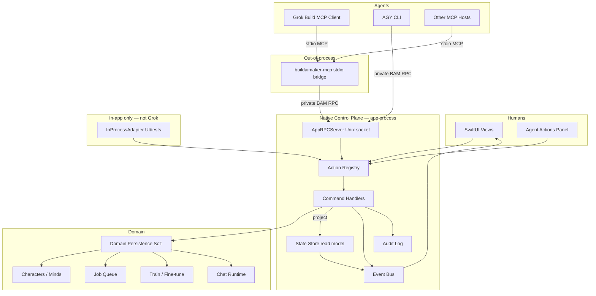
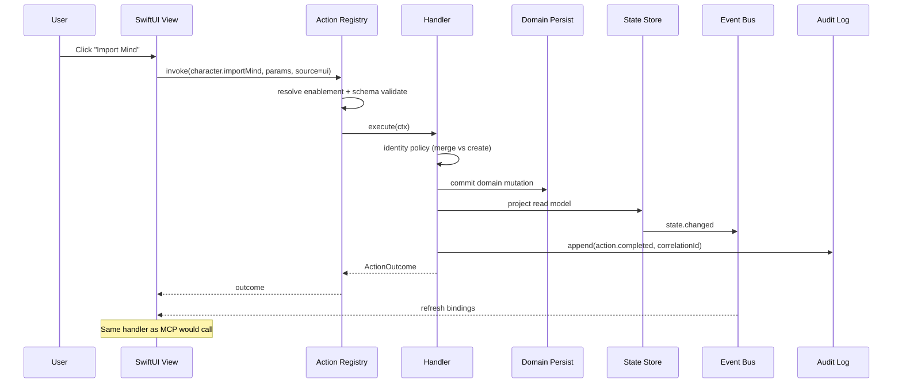

# Design: Native App Action API + MCP Control Plane

| Field | Value |
|-------|--------|
| **Status** | Draft (rev 2.2 — product decisions closed) |
| **Date** | 2026-08-09 |
| **Revision** | 2.2 |
| **Authors** | BuildAIMaker / systems architecture |
| **Audience** | Product, platform, MCP integrators, Grok Build, AGY CLI |
| **Scope** | Local-first native apps (macOS primary; portable patterns) |
| **Related product** | BuildAIMaker (BAM*) character studio |
| **Implementability** | **Layer A** (control plane core): ready after this rev. **Layer B** (Grok MCP): contracts specified; dogfood after PR8a–8d. **Layer C** (AGY CLI): contract specified; implement after MCP dogfood (Phase 5). |

---

## Overview

This document proposes a **Native Action API**: a first-class, versioned control plane inside native applications that:

1. **Unifies human and agent control** — every meaningful UI action is also an invokable API command with the same handler, validation, and side effects.
2. **Exposes app state without Accessibility** — agents read structured snapshots (route, selection, jobs, models) from an explicit state store, not by scraping the UI tree.
3. **Maps 1:1 to MCP tools** — MCP is a **transport projection** of the Action Registry. For external hosts (Grok Build), a **stdio bridge process** connects to the app over a local Unix socket; the app owns the control plane in-process.
4. **Serves CLI-like consumers** — Grok Build MCP today; AGY CLI and headless CI tomorrow, using the same action names, schemas, and outcome envelope.

**Thesis:** In the agent era, a native app’s real UI is not only pixels—it is a **shared control plane** where humans and agents operate the same commands against the same state. Accessibility automation and remote UI protocols (A2UI-style) are insufficient for deep, dynamic, local-first product work. The app must own an Action Registry + State Store + Event Bus; MCP and CLI are **transports and projections** of that plane, not the plane itself.

BuildAIMaker is the first product to adopt this design: create characters, teach data, fine-tune (open MLX LoRA + Apple adapters), chat, job queue, mind datasets—all should go through the Action API so that UI, MCP, and CLI cannot diverge (e.g. reimport creating duplicate “Robby mind” copies because one path bypassed the other).

### Related product / repo assumptions

- **Canonical product tree:** full BAM* SPM packages and app surface live in the primary BuildAIMaker monorepo (layout TBD by product). This design is the contract; implementation lands where the packages already exist.
- **This workspace (`Documents/GitHub/buildaimaker`)** may currently hold design/docs only (sparse). That does **not** invalidate PR order: PRs remain sequenced as listed; estimates assume work against the full tree when available. See [PR Plan](#pr-plan).
- Recent product surface assumptions (when present in tree): 3-column UI, Train vs Fine-tune naming, Propose examples, Apple FM vs open models, job queue, mind datasets.

---

## Background & Motivation

### BuildAIMaker path

BuildAIMaker is a **local-first macOS Swift** character studio:

- Create characters, teach data, fine-tune (open MLX LoRA + Apple Foundation Models / adapters).
- Chat with characters; manage mind datasets and training jobs.
- Stack: SPM packages under the BAM* family.

Known class of bugs (illustrative): **every reimport creates a new “Robby mind” copy**. Root cause pattern: multiple code paths (UI, import, possibly future agent) mutate datasets without a single idempotent command and identity policy. An Action API forces one handler, one policy, one audit trail.

### Why this epiphany now

Native apps need an **easy-to-access API** so we can:

- Expose a **stdio MCP bridge** that Grok Build (and other hosts) can spawn, which proxies to the running app.
- Display/expose actions in the UI that come from both the **MCP/tool surface** and **native UI** (shared catalog).
- Let agents **know UI/app state** without Accessibility.
- Let actions **control results through a real API** — MCP tools are counterparts of UI actions, not screen-driving scripts.

### The Accessibility trap

Automating via Accessibility (AX) APIs:

| Aspect | Problem |
|--------|---------|
| Fragility | Labels, hierarchy, and focus change with every UI polish. |
| Semantics | AX sees “button” not `character.importMind(id:, mergePolicy:)`. |
| State | Incomplete, slow, privacy-sensitive; no structured job queue or model catalog. |
| Trust | Feels like malware; poor for App Store and user mental model. |
| Bidirectionality | Hard to “show what the agent can do” as first-class UI. |

**This design is explicitly NOT Accessibility automation.**

### A2UI and remote-UI limits

A2UI-style approaches (agent-driven remote UI descriptions rendered by a host) are useful for **generated or ephemeral UIs**, but feel limited when:

- The product is a **deep native studio** (GPU jobs, file system, sandbox, multi-column selection, local models).
- Interaction must be **dynamic at the native app level** (same shortcuts, same undo/confirm, same offline path).
- Agents need **app truth** (job IDs, character IDs, dataset digests), not a parallel remote form model.

A2UI may coexist later as a **presentation adapter** for agent-suggested panels; it should not be the control plane. See [Positioning](#positioning-a2ui-vs-native-action-api--mcp) and [A2UI coexistence interface](#a2ui-coexistence-interface-deferred).

### Agent-era UI

The user-facing insight: **agent + human share one control plane**. The Agent Actions panel, menu items, keyboard shortcuts, MCP tools, and CLI subcommands are projections of one Action Registry. That is the beginning of a new AI-era UI pattern for local-first native software.

---

## Goals & Non-Goals

### Goals

1. **Single control plane** — All product mutations and primary navigations go through registered Actions with versioned schemas.
2. **State as API** — Structured, versioned state snapshots (and deltas/events) available to UI, MCP, and CLI without AX. Default MCP/CLI snapshots are **slim** and size-budgeted for host caps.
3. **1:1 MCP mapping** — Every tool-safe action is discoverable as an MCP tool; parameters and results match the action schema. External hosts reach the plane via **stdio bridge → app Unix socket**.
4. **CLI-ready contracts** — Same action names, outcome envelope, and error codes work as AGY CLI subcommands (implementation after MCP dogfood; contract specified in this doc).
5. **Dual rendering** — UI binds to actions; optional Agent Actions panel lists the same catalog; MCP advertises the same.
6. **Safety** — Destructive/expensive ops require confirmation policy (human UI authoritative by default); audit log; local auth for connectors; path allowlists for agent filesystem params.
7. **BuildAIMaker-first rollout** — Phased adoption with feature flags; fix dual-write bugs by funneling imports/jobs through actions.
8. **Portable pattern** — Documented so other native apps (and future platforms) can implement the same contracts.

### Non-Goals

1. **Not** remote multi-tenant SaaS control of the app over the public internet (local-first; optional later with different threat model).
2. **Not** replacing SwiftUI with a web UI or Electron for “agentability.”
3. **Not** full OS automation or controlling other apps via AX.
4. **Not** inventing a new LLM protocol—use MCP where appropriate; actions remain the source of truth.
5. **Not** guaranteeing real-time pixel-perfect UI sync for remote renderers (state is logical, not frame-level).
6. **Not** auto-generating the entire UI from the action catalog (UI can be hand-crafted; it must *call* actions).
7. **Not** solving general multi-user collaboration CRDTs in v1 (single-user local machine focus).
8. **Not** embedding agents inside the app process as the Grok integration path (bridge is out-of-process).
9. **Not** streaming MCP tool results / chat tokens over stdio in v1 (poll jobs; chat out of MCP or async-only).

---

## Positioning: A2UI vs Native Action API + MCP

| Dimension | A2UI / agent-remote UI | Accessibility automation | **Native Action API + MCP** |
|-----------|------------------------|---------------------------|-----------------------------|
| Control semantics | Forms / declarative UI trees from agent | Click/type on AX nodes | Versioned commands + structured state |
| App state | Often parallel or mirrored; **can** call a backend API if designed so | Scraped, incomplete | Explicit State Store (read model); domain persistence is source of truth |
| Native depth | Limited for GPU, FS, sandbox unless host is the app | High friction | First-class handlers in-process in the product |
| Dynamic interaction | Constrained by host renderer | Fragile | Full native UX + same API |
| Tool surface | Can be ad hoc **or** call a shared API | None (scripts) | MCP tools = actions (generated) |
| CLI / CI | Possible if backend is CLI-shaped; **remote UI itself** is a poor fit | Poor fit | Headless session, same actions |
| Trust model | Host may render untrusted UI trees (threat model host-dependent) | OS trust / malware feel | Local app-owned API, allowlists, confirmations |
| Dual human+agent UI | Possible | No | Shared catalog, Agent Actions panel |
| Idempotency / identity | Easy to get wrong if agents bypass product handlers | N/A | Enforced in handlers (anti–Robby-mind) |
| Offline / local-first | Depends | Local only | Natural fit |

**Thesis (repeated for clarity):** A2UI optimizes for *agent-shaped glass*. Native Action API optimizes for *product-shaped power* with agents as first-class operators. BuildAIMaker chooses the latter as primary; A2UI remains optional presentation sugar.

### A2UI coexistence interface (deferred)

**Non-goal for at least 12 months** unless product reopens. If ever embedded:

1. Agent-proposed panels may **only** emit Action invokes (`paramsSchema`-bound); **no direct domain access**.
2. Panel trees are versioned; app validates against an allowlisted component set.
3. Untrusted UI trees never write persistence; submit path is `ActionRegistry.invoke`.
4. Label “Suggested by agent”; same confirm policies as MCP.

---

## Proposed Design

### Control plane components

```
┌─────────────────────────────────────────────────────────────────────────┐
│                         BuildAIMaker Process                            │
│                                                                         │
│  ┌──────────────┐   invoke    ┌─────────────────┐   mutate   ┌────────┐ │
│  │ SwiftUI /    │ ──────────► │ Action Registry │ ─────────► │ Domain │ │
│  │ Agent Panel  │             │ + Command       │            │ Persist│ │
│  └──────▲───────┘             │   Handlers      │            │ (SoT)  │ │
│         │                     └────────┬────────┘            └───┬────┘ │
│         │ observe                      │                         │      │
│         │                     ┌────────▼────────┐  project       │      │
│  ┌──────┴───────┐   snapshot  │  State Store    │ ◄──────────────┘      │
│  │ View Models  │ ◄────────── │  (read model;   │                       │
│  └──────────────┘             │   single writer)│                       │
│                               └────────┬────────┘                       │
│                                        │ events                         │
│                               ┌────────▼────────┐                       │
│                               │   Event Bus     │                       │
│                               │ action.*, state.*│                      │
│                               └────────┬────────┘                       │
│                                        │                                │
│  ┌─────────────────────────────────────▼──────────────────────────────┐ │
│  │ Transport adapters (in-app)                                        │ │
│  │  • AppRPCServer (Unix socket; private BAM RPC)                     │ │
│  │  • InProcessAdapter (UI / unit tests only — not Grok)              │ │
│  │  • HeadlessHost                                                    │ │
│  └────────────────────────────────────────────────────────────────────┘ │
└─────────────────────────────────────────────────────────────────────────┘
          ▲                              ▲
          │ Unix socket                  │ Unix socket
          │ (private BAM RPC)            │
┌─────────┴──────────┐         ┌─────────┴──────────┐
│ buildaimaker-mcp   │         │ agy bam / CLI      │
│ (stdio MCP bridge) │         │ (same App RPC)     │
│ spawned by Grok    │         └────────────────────┘
└─────────▲──────────┘
          │ stdio MCP
┌─────────┴──────────┐
│ Grok Build / other │
│ MCP hosts          │
└────────────────────┘
```

#### 1. Action Registry

- Catalog of all actions: `id`, `version`, `title`, `description`, `paramsSchema`, `resultSchema`, `risk`, `scopes`, `ui`, `mcp`, `cli`.
- Registration is compile-time and/or module-init (`BAMControlPlane` package — see [Package naming](#package-naming--module-boundaries)).
- Supports **feature flags** and **enablement predicates** (e.g. action disabled if required params missing).
- **Stability contract:** action `id` is a stable string (`character.importMind`); breaking param/result changes bump `version` or introduce a new id. MCP tool names are a **versioned mapping table** (renames do not silently break hosts).

#### 2. Command Handlers

- One handler per action: `async throws -> ActionOutcome`.
- Handlers:
  - Validate params (JSON Schema / Codable).
  - Enforce preconditions against State Store / domain.
  - Apply domain mutations **only here** (or via domain services called only from handlers).
  - Commit domain + project State Store in **one unit** (see [State Store invariant](#3-state-store)).
  - Emit audit events + domain events.
  - Return structured outcome (IDs, job handles, not opaque UI state).
- **Invariant:** UI must not write domain state except by invoking handlers (no “quick path” that skips the API—this is how Robby-mind duplicates appear).

#### 3. State Store

**Invariant (dual-truth prevention):**

| Role | Responsibility |
|------|----------------|
| **Domain persistence** | **Source of truth** (characters, minds, jobs on disk/DB). |
| **State Store** | **Read model projection** of domain + session UI state (route, selection). Rebuilt/updated **transactionally** with handler commits. |
| **MCP / CLI / UI** | Never write State Store directly; only via handlers. |

- Single logical store projecting **read models** for:
  - Navigation / route (e.g. `studio.character.detail`)
  - Selection (characterId, mindId, datasetId, message thread) — **session UI state**, not domain SoT
  - Catalogs (characters, minds, models, adapters) — summary projections
  - Jobs (queue, status, progress, logs tail)
  - Capabilities (Apple FM available?, MLX device, disk free)
  - Session (active clients, feature flags, protocol version)
- Updates only from handlers that commit domain **and** project in one unit (or authorized domain services **invoked only from handlers**).
- On launch: **rebuild projection from domain persistence** (+ restore session route/selection from user defaults if desired).
- Consumers subscribe to snapshots or event-sourced deltas.
- Snapshot is **JSON-serializable** for `app.getState` and CLI `--json`.

#### 4. Event Bus

- Topics (examples):
  - `action.invoked` / `action.completed` / `action.failed`
  - `state.changed` (with JSON Patch or field paths)
  - `job.progress` / `job.completed`
  - `confirm.required` / `confirm.resolved`
- **v1 streaming matrix** (see [Streaming / progress matrix (v1)](#streaming--progress-matrix-v1)):
  - **In-app UI:** Event Bus drives Jobs column, banners, progress.
  - **Grok / stdio MCP:** **poll-only** for jobs and state; do not depend on mid-tool notifications.
  - **No streaming MCP tools in v1** (including `chat.send` not exposed over MCP until async-only).
- Correlation IDs link UI click, MCP tool call, and job lifecycle.

### Mermaid: architecture



### Mermaid: sequence — human UI action



### Mermaid: sequence — Grok Build via stdio bridge

```mermaid
sequenceDiagram
  participant C as Grok Build
  participant B as buildaimaker-mcp
  participant RPC as AppRPCServer
  participant M as MCP/RPC Adapter
  participant R as Action Registry
  participant H as Handler
  participant S as State Store

  Note over C,B: Grok spawns bridge; MCP over stdio
  C->>B: initialize / tools/list
  B->>RPC: connect + auth hello (or APP_NOT_RUNNING path)
  alt app running
    B->>RPC: ListTools
    RPC->>M: exportMCPCatalog()
    M->>R: registry (frozen for bridge process; reconnect does not refresh tools)
    R-->>C: tools[] (via B)
  else app not running
    Note over B: Still initialize OK; tools listed
    Note over B: Each call returns APP_NOT_RUNNING
  end

  C->>B: tools/call app_get_state
  B->>RPC: Invoke(app.getState, slim query)
  RPC->>S: slim snapshot
  S-->>C: slim StateSnapshot JSON

  C->>B: tools/call character_import_mind
  B->>RPC: Invoke(..., source=mcp, clientId)
  RPC->>R: invoke
  R->>R: allowlist + risk policy
  alt needs human confirmation
    R-->>C: ok=false code=NEEDS_CONFIRMATION + token
    Note over C: User approves in BAM UI banner
    C->>B: tools/call app_confirm optional if policy allows
    R->>H: execute after allow
  else allowed
    R->>H: execute
  end
  H-->>C: ActionOutcome JSON
  Note over C: Long jobs return jobId; poll job_get
```

### Mermaid: sequence — state sync

```mermaid
sequenceDiagram
  participant H as Handler
  participant D as Domain Persist
  participant S as State Store
  participant E as Event Bus
  participant UI as UI Bindings
  participant CLI as Headless Waiter

  H->>D: commit
  H->>S: project revision N+1
  S->>E: state.changed{rev, paths}
  par
    E->>UI: apply snapshot/diff
  and
    E->>CLI: unblock wait --rev N+1
  end
  Note over S: Single writer; consumers eventually consistent by rev
  Note over E: MCP Grok v1 does not rely on push notifications
```

### Action schema (JSON-serializable, versioned)

Stable conceptual shape (Swift Codable ↔ JSON):

```json
{
  "id": "character.importMind",
  "version": 1,
  "title": "Import Mind",
  "description": "Import or reimport a mind dataset for a character with explicit identity policy.",
  "paramsSchema": {
    "type": "object",
    "required": ["characterId", "sourceURI", "identityPolicy"],
    "properties": {
      "characterId": { "type": "string", "format": "uuid" },
      "sourceURI": { "type": "string" },
      "identityPolicy": {
        "type": "string",
        "enum": ["mergeByContentHash", "mergeByStableId", "alwaysCreate", "replaceExisting"]
      },
      "existingMindId": { "type": "string", "format": "uuid" },
      "displayName": { "type": "string" },
      "clientMutationId": { "type": "string", "description": "Optional idempotency key for retries" },
      "expectedRevision": { "type": "integer", "description": "Optional CAS against state revision" }
    }
  },
  "resultSchema": {
    "type": "object",
    "properties": {
      "mindId": { "type": "string", "format": "uuid" },
      "created": { "type": "boolean" },
      "merged": { "type": "boolean" },
      "contentHash": { "type": "string" }
    }
  },
  "risk": "write",
  "riskByParam": {
    "identityPolicy": {
      "replaceExisting": "destructive"
    }
  },
  "scopes": ["characters.write", "filesystem.read"],
  "confirmPolicy": "none",
  "confirmPolicyByParam": {
    "identityPolicy.replaceExisting": "always"
  },
  "timeoutClass": "long",
  "ui": {
    "placement": ["toolbar", "contextMenu"],
    "sfSymbol": "square.and.arrow.down",
    "enabledWhen": "params.characterId != null || selection.characterId != null"
  },
  "mcp": {
    "toolName": "character_import_mind",
    "enabled": true,
    "requireExplicitIds": true
  },
  "cli": {
    "subcommand": "character import-mind",
    "enabled": true
  }
}
```

**Risk levels:**

| Level | Meaning | Examples |
|-------|---------|----------|
| `read` | No mutation of domain or session | `app.getState`, `job.get`, `character.list` |
| `session` | Mutates session UI state only (route/selection), not domain entities | `nav.go`, `selection.set` |
| `write` | Mutates domain | `character.create`, `dataset.addExamples`, import (non-replace) |
| `destructive` | Irreversible or identity-destroying domain ops | delete, wipe, `replaceExisting` import |
| `expensive` | Significant time/GPU/disk | fine-tune, train, model-backed propose |
| `external` | Network / outside machine (deny by default in v1) | future |

**Effective risk** = max(base `risk`, `riskByParam` for supplied params). **Effective confirmPolicy** similarly elevates (e.g. import with `replaceExisting` → always confirm).

**Timeout classes:** `short` (ms–s, complete in tool call), `long` (return `jobId` immediately). **No `stream` timeout class over MCP in v1.**

**Identity policy** on import-like actions is mandatory to prevent duplicate “Robby mind” entities.

### ActionOutcome / ActionError (canonical)

Every invoke (UI, MCP, CLI, in-process) returns the **same** envelope:

```json
{
  "schemaVersion": 1,
  "ok": true,
  "data": { },
  "error": null,
  "jobId": null,
  "stateRevision": 1843,
  "confirmation": null,
  "correlationId": "…",
  "clientMutationId": null
}
```

**Error object** (when `ok: false` or as companion detail):

```json
{
  "code": "NEEDS_CONFIRMATION",
  "message": "Human confirmation required before fine-tune starts.",
  "details": { "actionId": "finetune.start", "risk": "expensive" },
  "remediation": "Approve in the BuildAIMaker confirmation banner, or deny. Agents cannot self-confirm destructive actions."
}
```

**Confirmation challenge** (when issued):

```json
{
  "token": "conf_…",
  "actionId": "finetune.start",
  "risk": "expensive",
  "summary": "Start MLX LoRA fine-tune for character …",
  "expiresAt": "2026-08-09T18:05:00Z",
  "uiRequired": true
}
```

#### Outcome → MCP tool result

| ActionOutcome | MCP `isError` | MCP content |
|---------------|---------------|-------------|
| `ok: true` | `false` | JSON text of full outcome (or `data` + metadata fields) |
| `ok: false`, any code | **`false` for structured business outcomes** preferred so models parse JSON; set `isError: true` only for transport/protocol failures | Always include full outcome JSON with `error.code`, `message`, `remediation` |
| Transport failure (bridge ↔ app) | `true` | Text + code `APP_NOT_RUNNING` / `PROTOCOL_MISMATCH` / `AUTH_FAILED` |

**Rule:** Prefer **stable JSON always** in tool results so agents never see free-text-only errors. Hosts that only show `isError` still get remediation in content.

#### Outcome → CLI exit codes

| `error.code` / condition | Exit code |
|--------------------------|-----------|
| success (`ok: true`) | `0` |
| `VALIDATION_ERROR` | `2` |
| `NEEDS_CONFIRMATION` | `3` |
| `JOB_FAILED` | `4` |
| `DENIED` | `5` |
| `NOT_FOUND` | `6` |
| `CONFLICT` / CAS / revision | `7` |
| `PRECONDITION_FAILED` | `8` |
| `TIMEOUT` | `9` |
| `AUTH_FAILED` | `10` |
| `PROTOCOL_MISMATCH` | `11` |
| `PATH_NOT_ALLOWED` | `12` |
| `APP_NOT_RUNNING` / connect fail | `75` |
| `TRUNCATED` | `1` |
| `INTERNAL` / unknown | `1` |

#### Outcome → UI

| Outcome | UI |
|---------|-----|
| `ok` | Toast/silent refresh via state events |
| `NEEDS_CONFIRMATION` | Banner + modal (authoritative) |
| Other errors | Alert / inline error with `message` + `remediation` |

### State snapshot schema

#### Slim default (`app.getState` with no paths / default query)

**Hard size budget:** serialized JSON **≤ 12_000 bytes** for default slim snapshot (golden test enforced). Leaves margin under Grok’s default **~20_000 byte** MCP tool output cap (`max_output_bytes` / `GROK_MAX_MCP_OUTPUT_BYTES`).

```json
{
  "schemaVersion": 1,
  "projection": "slim",
  "revision": 1842,
  "timestamp": "2026-08-09T18:00:00Z",
  "app": {
    "name": "BuildAIMaker",
    "version": "0.x.y",
    "sessionId": "…",
    "protocolVersion": 1
  },
  "route": {
    "id": "studio.character.detail",
    "params": { "characterId": "…" }
  },
  "selection": {
    "characterId": "…",
    "mindId": "…",
    "datasetId": null,
    "jobId": null,
    "windowId": "main"
  },
  "counts": {
    "characters": 12,
    "minds": 15,
    "jobsRunning": 1,
    "jobsQueued": 0
  },
  "jobsSummary": [
    {
      "id": "…",
      "type": "finetune.mlx_lora",
      "status": "running",
      "progress": 0.42,
      "characterId": "…"
    }
  ],
  "capabilities": {
    "appleFM": true,
    "mlx": true,
    "gpu": "apple"
  },
  "flags": {
    "actionApiV1": true,
    "mcpServer": true
  },
  "pendingConfirmations": 1
}
```

**Not included in slim default:** full character/mind catalogs, chat transcripts, job logs, large hyperparam blobs.

#### Full / path-filtered snapshots

- `paths: ["selection", "jobs"]` returns only those top-level keys (still budget-checked).
- **Over-budget rule (normative):** MCP and CLI **fail closed** — return `ok: false`, `code: TRUNCATED`, remediation `"Use list tools or narrower paths"`; **do not** return partial JSON catalogs or half-snapshots. UI-only consumers may soft-truncate for display if desired; agents never see partial success. CLI exit code for `TRUNCATED` is **`1`**.
- Catalogs **must** use list actions with cursor pagination for agent workflows when `N` is large:
  - `character.list` `{ "cursor", "limit" }` → `{ "items", "nextCursor" }`
  - `mind.list`, `job.list`, `model.list` same pattern
- **Rule for integrators:** if `counts.characters > 20` (or any large catalog), **do not** request full catalogs via `app.getState`; use list actions.
- Grok integrators: document raising `max_output_bytes` only as escape hatch; **design must not require it**.

**Rules:**

- Snapshots are **projections**, not full DB dumps.
- `revision` is monotonic per session/store for lag detection.
- Multi-window: `selection` may be per `windowId`; MCP default window is configurable.
- Golden tests: max serialized size for default slim query; sample paginated lists.

### Dual rendering of actions

| Surface | Behavior |
|---------|----------|
| **Native UI** | Buttons/menus bind to `ActionID`; enablement from registry predicates + state. |
| **MCP tool catalog** | `tools/list` generated from registry (`mcp.enabled`); **frozen for the bridge process lifetime** (see [Tool catalog stability](#tool-catalog-stability-v1)). |
| **Agent Actions panel** | Optional column/sheet listing tool-safe actions with forms generated from `paramsSchema` or curated UI. |
| **CLI help** | `agy bam --help` mirrors action titles/descriptions via registry `cli.subcommand`. |

**Important:** Dual rendering does **not** mean dual handlers. One handler; many projections.

Example product UX:

- User teaches a character; Agent Actions shows `examples.propose`, `dataset.add`, `finetune.start`.
- Grok Build calls the same tools after slim `app_get_state` + `character_list` as needed.
- Progress appears in Jobs column for both; agents poll `job_get`.

---

## Transport & Hosts

### 0. Principles (read first)

| Consumer | Path |
|----------|------|
| **Grok Build / external MCP hosts** | **Only:** spawn **`buildaimaker-mcp`** (stdio MCP) → private BAM RPC over **Unix socket** → in-app Action Registry. |
| **SwiftUI / Agent panel / unit tests** | In-process adapter (same process as app). **Not** a Grok path. |
| **AGY CLI** | Same private BAM RPC over Unix socket (or spawn headless). |
| **Headless CI** | `BuildAIMaker --headless` owns a dedicated socket; same registry. |

**Never** document agents as living inside the app process. In-process MCP/adapters are for **UI and tests only**.

### 1. Stdio MCP bridge (primary Grok path) — `buildaimaker-mcp`

| Item | Spec |
|------|------|
| **Executable name** | `buildaimaker-mcp` (product); Swift target / alias `BAMMCPBridge` acceptable in repo |
| **Role** | Translate **stdio MCP JSON-RPC** ↔ **private BAM App RPC** on the app Unix socket |
| **Does not** | Embed the Action Registry or domain; if app is down, tools fail with structured errors |
| **Stderr** | Log to stderr; Grok captures under `~/.grok/logs/mcp/<server>.stderr.log` (or host-equivalent). Log connect attempts, auth failures, protocol version, disconnects—**not** full action params with secrets/paths by default |

#### Example Grok `config.toml`

```toml
[mcp_servers.buildaimaker]
command = "buildaimaker-mcp"
# args = []  # optional; bridge finds default socket
# env = { BAM_SOCKET = "/Users/you/Library/Application Support/BuildAIMaker/mcp.sock" }
```

Tool names as seen by the model (Grok namespacing): `buildaimaker__app_get_state`, `buildaimaker__character_import_mind`, etc. Registry `mcp.toolName` is the unprefixed tool name.

#### Startup / lifecycle

1. Grok spawns `buildaimaker-mcp`; MCP `initialize` **succeeds even if the app is not running** (prefer session startability).
2. Bridge attempts socket connect with **short timeout** (e.g. 500 ms–2 s).
3. If connect fails: tools remain listed; **every** `tools/call` returns structured `APP_NOT_RUNNING` with remediation `"Open BuildAIMaker"`.
4. If connect succeeds: **auth hello** (token), **version negotiation**; then proxy calls.
5. On app quit: socket closes; subsequent calls → `APP_NOT_RUNNING`; bridge process stays up until Grok kills it (reconnect on next call with backoff).
6. Bridge **exit codes:** `0` clean shutdown; `1` fatal misconfig; do not exit solely because app is quit (keeps MCP session alive with actionable errors).

#### Tool catalog stability (v1)

**Law:** MCP `tools/list` content is **frozen for the bridge process lifetime** — captured at first successful `ListTools` (or from the static embedded fallback of `mcp.enabled` actions at bridge build time if the app is down). **Reconnect re-establishes Hello/auth only; it does not re-advertise or refresh tools.** App upgrades mid-session → `PROTOCOL_MISMATCH` and/or missing actions fail on invoke until the user **restarts the MCP server** (new bridge process). Grok hosts typically cache tools at session start, so mid-session re-export would not reach the model anyway.

- Feature-flag / allowlist / Settings changes: **restart MCP** (new bridge process) required for catalog changes; reconnect alone is insufficient.
- **Soft enablement:** if `mcp.enabled`, tool stays listed for the process lifetime; invoke may return `PRECONDITION_FAILED` / `DENIED` with remediation (avoids thrash from disappearing tools).
- Future: MCP `notifications/tools/list_changed` if host supports it—**not required for v1**.

### 2. Local IPC / Unix socket (app-owned)

- Default path: `~/Library/Application Support/BuildAIMaker/mcp.sock`
- Token file (default): `~/Library/Application Support/BuildAIMaker/mcp.token` (mode `0600`)
- PID / lock file: `~/Library/Application Support/BuildAIMaker/mcp.lock` (or combined protocol)
- Permissions: socket/dir `0600` / `0700`
- Wire protocol: **private BAM App RPC** (not raw MCP on the socket). Bridge and CLI speak this RPC. See [Appendix D — Local transport v1](#appendix-d--local-transport-v1).

#### Token path (normative)

**Token lives next to the socket it authenticates.** For a socket at `<dir>/<name>.sock`, the default token path is **`<dir>/mcp.token`** (same directory as the socket; fixed basename `mcp.token`). Overrides:

| Source | Effect |
|--------|--------|
| Default / GUI | `…/BuildAIMaker/mcp.sock` + `…/BuildAIMaker/mcp.token` |
| Headless | `…/BuildAIMaker/mcp-headless.sock` + `…/BuildAIMaker/mcp.token` in that same dir |
| `--socket` / `BAM_SOCKET` | Token = `mcp.token` in the **same directory** as the overridden socket path |
| `BAM_TOKEN` (optional) | Explicit token **file path** override; takes precedence over sibling default |

Hello always authenticates with the token resolved for the socket being connected. Bridge and CLI **must** use the same rule so they never disagree and spuriously return `AUTH_FAILED`.

#### Single-instance ownership & stale socket

**Algorithm (GUI app bind):**

1. Resolve socket path + lock path under Application Support.
2. If lock exists: read PID; if process alive **and** is BuildAIMaker → **refuse second GUI instance** with UI: “BuildAIMaker is already running.” Exit non-zero for second process.
3. If lock PID is dead (or not BAM) **or** socket exists but connect fails with connection refused → **stale**: `unlink` socket (and lock), then bind.
4. If bind fails with EADDRINUSE after cleanup → error and exit.
5. Write lock with current PID; bind socket `0600`; write/rotate token if missing.
6. On clean quit: unlink socket + lock.

**Headless vs GUI:**

| Mode | Socket | Mutual exclusion |
|------|--------|------------------|
| GUI | `mcp.sock` | Single GUI owner |
| Headless | `mcp-headless.sock` | Single headless owner; **may** run alongside GUI only if product allows dual stores—**v1 default: refuse headless if GUI lock held**, and vice versa, unless `--allow-parallel` (dev only) |

**Recovery for users/agents:**

- Error `APP_NOT_RUNNING` → open BuildAIMaker.
- Error `INSTANCE_CONFLICT` → quit other instance or attach to the correct socket via `BAM_SOCKET`.
- Manual recovery: quit app; if needed delete `mcp.sock` / `mcp.lock` only when no BAM process is running (document in doctor docs).

### 3. Headless session (no UI, same packages)

- `BuildAIMaker --headless` or `BAMHeadless` executable linking same packages.
- Loads/persists same domain stores; no SwiftUI.
- For CI, batch fine-tunes, AGY CLI scripts.
- Same Action Registry; confirmations via flags (`--yes`) or non-interactive deny for destructive without flags.
- Socket: `mcp-headless.sock` per rules above.

### 4. In-process adapter (UI / tests only)

- Same-process invoke of registry; zero socket.
- Used by SwiftUI, Agent Actions panel, unit/integration tests.
- **Not advertised as a Grok Build integration path.**

### 5. Mapping to Grok Build MCP

| Concern | Design |
|---------|--------|
| Transport | **`buildaimaker-mcp` stdio → app Unix socket** (only documented Grok path) |
| Tool names | Snake_case from action ids; host may show `buildaimaker__<tool>`; stable mapping table versioned with app |
| Discovery | `tools/list` from registry export; filter by allowlist profile `grok-build-default`; **frozen per bridge process** (no refresh on reconnect) |
| State | Tool `app_get_state` **slim by default**; catalogs via `character_list`, `job_list`, … |
| Output size | Slim ≤12KB; document Grok ~20KB cap and `GROK_MAX_MCP_OUTPUT_BYTES` |
| 1:1 | No mega-tools; granular actions; composite recipes client-side or explicit `workflow.*` |
| Progress | Long tools return `{ "jobId" }` immediately; **poll** `job_get` / `job_list`. No multi-minute blocks; no stream tools in v1 |
| Session isolation | Each MCP session has `clientId`, correlation namespace; confirm tokens not shared across clients |
| Multi-app | Server name `buildaimaker` → Grok `server__tool` namespacing |
| Timeouts | Grok tool timeouts may be large; still return `jobId` for trains—do not block the session UX |

### 6. AGY CLI contract

> Implementation ships in Phase 5 **after** MCP dogfood. Contract below is **normative** so Goals “CLI-ready” means ready-to-implement, not already shipped.

#### Global flags

| Flag | Meaning |
|------|---------|
| `--socket <path>` | Override socket path (token still co-located unless `BAM_TOKEN`) |
| env `BAM_SOCKET` | Same as `--socket` |
| env `BAM_TOKEN` | Optional override of token **file path** |
| `--headless` | Prefer headless socket / spawn headless if configured |
| `--json` | Machine-readable outcome envelope on stdout |
| `--yes` | Auto-allow confirmations **only** where policy allows CLI self-confirm (never for destructive unless explicit product override) |
| `--timeout <sec>` | Connect + call timeout (default connect 5s) |
| `--correlation-id <id>` | Pass-through correlation |
| `-h` / `--help` | Help from registry |

#### Connection algorithm

1. Resolve socket: `--socket` > `BAM_SOCKET` > GUI `mcp.sock` if lock alive > headless sock if `--headless` > else try GUI then fail `APP_NOT_RUNNING` (exit 75).
2. Auth hello with token for that socket: `BAM_TOKEN` if set, else `mcp.token` in the **same directory** as the resolved socket (see [Token path](#token-path-normative)).
3. Version negotiate; on mismatch exit 11 `PROTOCOL_MISMATCH`.
4. Map subcommand → action id via registry `cli.subcommand` (**generated**, not hand-maintained long-term).

#### Subcommands (initial; generated from registry)

```text
agy bam state [--json] [--paths selection,jobs]
agy bam character list [--cursor …] [--limit 50] [--json]
agy bam character import-mind --character <id> --source <uri> --policy mergeByContentHash [--json]
agy bam finetune start --character <id> --recipe mlx_lora [--yes] [--json]
agy bam job list|get|wait|cancel …
agy bam confirm <token> --decision allow|deny [--json]
agy bam --help
```

#### JSON envelope (stdout with `--json`)

```json
{
  "schemaVersion": 1,
  "ok": true,
  "error": null,
  "data": { },
  "jobId": null,
  "stateRevision": 1843,
  "correlationId": "…"
}
```

Same codes/fields as ActionOutcome. Exit codes per [Outcome → CLI exit codes](#outcome--cli-exit-codes).

#### Non-TTY matrix

| Situation | Behavior |
|-----------|----------|
| Needs confirm, no TTY, no `--yes` | Exit 3; JSON/text with token + remediation |
| Needs confirm, TTY, no `--yes` | Prompt (optional v1; may still require UI for destructive) |
| App not running | Exit 75; remediation open app or `--headless` |
| Job wait | Stream progress lines to stderr; final outcome stdout; or `--json` only final |

#### Job logs

- `agy bam job wait <id>`: poll; print progress to stderr; optional `--follow-logs` tails capped log lines.
- Do not dump unbounded logs to stdout in `--json` mode (path to log file or last N lines in `data`).

---

## Streaming / progress matrix (v1)

| Channel | State events | Job progress | Chat tokens |
|---------|--------------|--------------|-------------|
| In-app UI | Event Bus push | Event Bus + Jobs column | In-app stream only |
| Grok / stdio MCP | **Poll** `app_get_state` / lists | **Poll** `job_get` only | **Not in MCP v1** (`chat.send` MCP-disabled or returns `messageId` + poll later if product insists) |
| AGY CLI | Poll / `job wait` | Poll | N/A |

Event Bus “SSE-equivalent” language applies to **in-app** and future transports that support notifications—not Grok stdio v1.

---

## Confirmation state machine

```
                 issue (destructive/expensive per policy)
                            │
                            ▼
                     ┌─────────────┐
          TTL 5 min  │   pending   │  max pending per client: 8
          ─────────► │             │  max global pending: 32
                     └──────┬──────┘
            ┌───────────────┼───────────────┐
            ▼               ▼               ▼
         allow            deny           expire
            │               │               │
            ▼               ▼               ▼
        execute          DENIED      NEEDS_CONFIRMATION
        (handler)                    (expired token)
```

| Rule | Spec |
|------|------|
| **Token** | Opaque `conf_…`; high entropy; stored server-side with actionId, params digest, clientId, risk, expiresAt |
| **TTL** | Default **5 minutes**; auto-deny/expire |
| **UI** | Banner + modal is **authoritative for human approval** |
| **Agent `app_confirm`** | Succeeds only if **policy allows agent self-confirm** for that risk (see matrix). Default: **never** for `destructive`; **never** for `expensive` from MCP (human UI or CLI with explicit rules) |
| **Dual path** | If user allows in UI while agent also calls `app_confirm`, first wins; second gets `NOT_FOUND` / `CONFLICT` (token consumed) |
| **MCP mapping** | `ok: false`, `code: NEEDS_CONFIRMATION`, `confirmation` object populated; stable JSON (not only free text) |
| **Rate limit** | Cap pending challenges; further destructive calls → `DENIED` with remediation |

### Confirmation policy profiles

| Profile | `destructive` | `expensive` | Notes |
|---------|---------------|-------------|-------|
| `default` / `grok-build-default` | Human UI only | Human UI only | Ship default |
| `cli-interactive` | TTY prompt or UI | TTY/`--yes` or UI | |
| `cli-ci` | Deny unless `--yes` **and** allowlisted action | `--yes` allowed for expensive | Destructive still dual-gated in v1 |
| `trusted-auto-expensive` | Human UI only | Auto-allow | **Product opt-in** only (Open Q4); off by default |

**Open product choice:** whether Settings may enable `trusted-auto-expensive` for a pinned clientId. Design default: **off**; matrix row reserved.

---

## Concurrency: dual clients (UI + agent + subagents)

Humans and agents share one plane and one handler pipeline.

| Concern | v1 rule |
|---------|---------|
| **Handler execution** | Per-entity serialization for mutating actions on the same `characterId` / `mindId` / `jobId` (queue in-process); independent entities may run concurrent reads |
| **Optimistic concurrency** | Optional `expectedRevision` on writes; on mismatch → `CONFLICT` + current revision + remediation “re-read state” |
| **Idempotency** | Optional `clientMutationId` on write/destructive/expensive; see [clientMutationId retention](#clientmutationid-retention-v1) |
| **Selection thrashing** | MCP **must not** rely on `selection.*` for writes. Write actions require explicit entity IDs (`requireExplicitIds`). `selection.set` may be omitted from `grok-build-default` allowlist or marked low-priority |
| **Job fairness** | FIFO job queue per user store; no agent-priority preemption in v1 |
| **Subagents (Grok)** | Multiple concurrent tool calls may share one bridge + one socket session namespace. Confirm tokens are per-challenge not per-subagent. Document risk: two subagents should not race the same entity without CAS |
| **Multi-window** | `windowId` in context for session actions; domain writes use entity IDs |

### ActionContext fields (normative)

```swift
public struct ActionContext: Sendable {
    public var source: ActionSource  // ui, mcp, cli, internal
    public var clientId: String?
    public var correlationId: String
    public var windowId: String?
    public var confirmToken: String?
    public var clientMutationId: String?   // idempotency
    public var expectedRevision: Int?      // CAS
}
```

Also accepted as top-level optional params on write actions for transports that only pass JSON arguments.

**v1 strongly recommended on:** `character.importMind`, `character.delete`, `finetune.start`, `minds.dedupe`, any `destructive`.

### `clientMutationId` retention (v1)

| Rule | Spec |
|------|------|
| **Store key** | `(clientId ?? "local", clientMutationId)` — not global across clients |
| **Behavior** | Duplicate key for a completed invoke returns the **prior `ActionOutcome`** (idempotent retry) |
| **Retention** | **In-process until app restart** (not required to survive relaunch in v1). After restart, the same id may execute again. |
| **Capacity** | Cap at **1024** entries; on overflow **drop oldest**; if a dropped key is retried, the action runs again (not `CONFLICT` unless entity CAS fails) |
| **Persistence** | v1 does **not** persist the cache with domain commits. Agents that need cross-relaunch safety should re-read state / use identity policies (e.g. `mergeByContentHash`) rather than relying on mutation-id replay. |
| **Absent id** | No idempotency; every invoke may mutate |

---

## API / Interface sketch

### Swift protocols (illustrative)

```swift
public struct ActionID: Hashable, Codable, Sendable {
    public let rawValue: String  // "character.importMind"
}

public enum ActionRisk: String, Codable, Sendable {
    case read, session, write, destructive, expensive, external
}

public struct ActionContext: Sendable {
    public var source: ActionSource
    public var clientId: String?
    public var correlationId: String
    public var windowId: String?
    public var confirmToken: String?
    public var clientMutationId: String?
    public var expectedRevision: Int?
}

public struct ActionErrorDTO: Codable, Sendable {
    public var code: String
    public var message: String
    public var details: JSONValue?
    public var remediation: String?
}

public struct ConfirmationChallenge: Codable, Sendable {
    public var token: String
    public var actionId: String
    public var risk: ActionRisk
    public var summary: String
    public var expiresAt: Date
    public var uiRequired: Bool
}

public struct ActionOutcome: Codable, Sendable {
    public var schemaVersion: Int  // 1
    public var ok: Bool
    public var data: JSONValue?
    public var error: ActionErrorDTO?
    public var jobId: String?
    public var stateRevision: Int?
    public var confirmation: ConfirmationChallenge?
    public var correlationId: String
    public var clientMutationId: String?
}

public protocol ActionHandler: Sendable {
    var definition: ActionDefinition { get }
    func execute(params: JSONValue, context: ActionContext) async throws -> ActionOutcome
}

public protocol ActionRegistry: Sendable {
    func register(_ handler: any ActionHandler)
    func definition(for id: ActionID) -> ActionDefinition?
    func list(filter: ActionFilter) -> [ActionDefinition]
    func invoke(_ id: ActionID, params: JSONValue, context: ActionContext) async -> ActionOutcome
}

public protocol StateStore: Sendable {
    var revision: Int { get }
    func snapshot(query: StateQuery) async -> StateSnapshot  // default slim
    func updates() -> AsyncStream<StateEvent>
}

public protocol EventBus: Sendable {
    func publish(_ event: BusEvent)
    func subscribe(_ filter: EventFilter) -> AsyncStream<BusEvent>
}

public protocol AppRPCServer: Sendable {
    /// Private BAM RPC over Unix socket; used by bridge + CLI
    func serve(socketPath: URL) async throws
}

public protocol MCPBridgeTranslating: Sendable {
    /// stdio MCP ↔ App RPC (lives in buildaimaker-mcp process)
    func runStdio() async throws
}
```

### JSON tool definitions (MCP)

```json
{
  "name": "app_get_state",
  "description": "Return a slim structured snapshot of BuildAIMaker (route, selection, job summaries, counts). Use list tools for catalogs. Keep under host output size limits.",
  "inputSchema": {
    "type": "object",
    "properties": {
      "paths": {
        "type": "array",
        "items": { "type": "string" },
        "description": "Optional subset, e.g. [\"selection\", \"jobsSummary\"]"
      },
      "windowId": { "type": "string" }
    }
  }
}
```

```json
{
  "name": "character_list",
  "description": "Paginated character catalog. Prefer over full state for large libraries.",
  "inputSchema": {
    "type": "object",
    "properties": {
      "cursor": { "type": "string" },
      "limit": { "type": "integer", "default": 50, "maximum": 100 }
    }
  }
}
```

```json
{
  "name": "character_import_mind",
  "description": "Import or reimport a mind with explicit identity policy (prevents duplicate minds). Requires characterId.",
  "inputSchema": {
    "type": "object",
    "required": ["characterId", "sourceURI", "identityPolicy"],
    "properties": {
      "characterId": { "type": "string" },
      "sourceURI": { "type": "string" },
      "identityPolicy": {
        "type": "string",
        "enum": ["mergeByContentHash", "mergeByStableId", "alwaysCreate", "replaceExisting"]
      },
      "existingMindId": { "type": "string" },
      "clientMutationId": { "type": "string" },
      "expectedRevision": { "type": "integer" }
    }
  }
}
```

```json
{
  "name": "finetune_start",
  "description": "Enqueue a fine-tune job; returns jobId immediately. May require human confirmation in the app.",
  "inputSchema": {
    "type": "object",
    "required": ["characterId", "recipe"],
    "properties": {
      "characterId": { "type": "string" },
      "recipe": {
        "type": "string",
        "enum": ["mlx_lora", "apple_adapter"]
      },
      "datasetId": { "type": "string" },
      "hyperparams": { "type": "object" },
      "clientMutationId": { "type": "string" },
      "expectedRevision": { "type": "integer" }
    }
  }
}
```

```json
{
  "name": "app_confirm",
  "description": "Resolve a pending confirmation if policy allows this client to confirm. Destructive defaults require human UI approval instead.",
  "inputSchema": {
    "type": "object",
    "required": ["token", "decision"],
    "properties": {
      "token": { "type": "string" },
      "decision": { "type": "string", "enum": ["allow", "deny"] }
    }
  }
}
```

```json
{
  "name": "job_get",
  "description": "Poll job status/progress. Prefer this over long blocking calls.",
  "inputSchema": {
    "type": "object",
    "required": ["jobId"],
    "properties": {
      "jobId": { "type": "string" },
      "includeLogTail": { "type": "boolean", "default": false }
    }
  }
}
```

---

## Security & Privacy

### Local trust model

- Default: **localhost / same-user** only. No remote bind in v1.
- Unix socket mode `0600`, directory `0700`, under user Application Support.
- **Token file** (`mcp.token` co-located with the socket, or `BAM_TOKEN` path) required on auth hello; rotate on user request.
- Honest limit: **same-user malware can read the token** and call the API—treat agent import paths and destructive tools as dangerous; confirmations and path allowlists are the real guardrails.
- Future: per-client allowlists (Grok Build vs unknown); optional peer code-sign check (best-effort).

### Path / filesystem policy (agent-facing)

| Rule | Spec |
|------|------|
| Allowed roots | User data directory; user-selected folders via security-scoped bookmarks; Settings **“Allowed folders for agent import”** |
| Rejection | `../` escapes after normalization; paths outside roots → `PATH_NOT_ALLOWED` |
| Sandbox | Prefer security-scoped bookmarks for user-picked paths; App Store builds must not assume arbitrary home read |
| Audit | Prefer **path digests** or basenames + root id in audit logs; full paths optional behind debug flag |
| `sourceURI` | Validate scheme (`file:`, app-specific); no arbitrary network fetch in v1 without `external` risk + deny default |

### Destructive and expensive ops

See [Confirmation state machine](#confirmation-state-machine). Summary:

| Risk | Default policy |
|------|----------------|
| `read` | Allow if client authorized |
| `session` | Allow; audit; MCP may restrict `selection.set` |
| `write` | Allow; audit |
| `destructive` | Human UI confirmation; CLI without `--yes` → deny/exit 3 |
| `expensive` | Human UI confirmation + estimate; returns `jobId` after allow |
| `external` | Deny by default |

### Sandbox & App Store

- MCP socket and file access must fit App Sandbox entitlements if distributed that way.
- May require **App Group** or user-selected folders for datasets.
- Entitlement matrix must be closed before App Store path (may differ from Developer ID). **Resolved (user):** **Developer ID first** for MCP dogfood; App Store entitlements later, not day-one.
- Prefer **in-app App RPC server** + stdio **bridge outside sandbox** or co-designed entitlements; sidecars complicate notarization.

### Tool allowlists

- Profiles: `full`, `read-only`, `train-only`, `grok-build-default`.
- `grok-build-default`: no selection-dependent writes; slim state; expensive/destructive confirm via UI.
- User-editable denylist in Settings.
- Registry fields `mcp.enabled` / `scopes` enforce server-side.

### Privacy

- State snapshots must **not** dump full chat transcripts by default; dedicated read actions with pagination later.
- Audit log: IDs, digests; store locally; user-clearable.
- No telemetry of action payloads to cloud unless user opts in (out of scope for v1).

---

## Observability

### Action audit log

Append-only local log (SQLite or JSONL):

| Field | Purpose |
|-------|---------|
| `timestamp` | When |
| `correlationId` | Link UI/MCP/job |
| `actionId` + `version` | What |
| `source` | ui / mcp / cli |
| `clientId` | Which agent |
| `paramsDigest` | Hash of params (paths redacted/digested) |
| `result` | ok / error code |
| `stateRevisionBefore/After` | Consistency |
| `jobId` | If async |

### Correlation IDs

- Generated at invoke boundary; propagated to jobs and events.
- Exposed in MCP results and UI job details (“Started by Grok Build”).

### Metrics (local)

- Action latency histograms, failure rates, confirmation deny rates, MCP disconnects, snapshot byte sizes.
- Debug panel: “Control Plane” with live registry and last N actions.

---

## Gotchas & Failure Modes

> **CRITICAL.** Treat these as design constraints, not footnotes. Severity: **P0** = data loss / trust failure; **P1** = serious UX/agent break; **P2** = polish / edge.

### Process lifetime (MCP without app) — **P0**

- Bridge is useless for mutations if app is quit.
- **Mitigations:** `APP_NOT_RUNNING` + remediation; optional headless daemon (**user opt-in**); bridge stays alive; document lifecycle in tool descriptions.
- Do not silently spawn unsigned background agents without user consent.

### Stale socket / multi-instance — **P0**

- Crash leaves `mcp.sock`; second instance races.
- **Mitigations:** PID lock + unlink-if-stale algorithm; refuse second GUI; separate headless socket; doctor docs.

### State lag / eventual consistency — **P1**

- UI and agents may observe different revisions briefly.
- **Mitigations:** `stateRevision` on every outcome; `expectedRevision` CAS on sensitive writes; read entity IDs from results not second-guessed selection.

### Dual write / Robby-mind style bugs — **P0**

- If UI import bypasses Action API, MCP and UI diverge.
- **Mitigations:** domain writes only from handlers; feature-flag old paths off; tests UI + programmatic share handler; identityPolicy required; migration `minds.dedupe`.

### Long-running jobs vs tool timeout — **P0/P1**

- Fine-tunes exceed any interactive wait.
- **Mitigations:** expensive actions **async**: enqueue + `jobId`; poll `job_get`; never block tool call for full train.

### Job orphaning on client disconnect — **P1**

- Agent disconnects after enqueue.
- **Decision:** jobs are **app-owned**; survive client death; cancel only via `job.cancel` or UI. Document: disconnect ≠ cancel.

### Confirmation UX from agent — **P0**

- See state machine; human UI authoritative for destructive/expensive defaults.

### Schema drift MCP tools vs actions — **P1**

- **Mitigations:** generate MCP catalog from registry only; CI golden tools snapshot; version field; deprecation window.
- Action id renames: keep old tool name in mapping table for one major or ship new tool + deprecation.

### Protocol version skew — **P1**

- App updates mid-Grok-session; bridge older/newer.
- **Mitigations:** `protocolVersion` in hello; `PROTOCOL_MISMATCH` with remediation “restart MCP / update BuildAIMaker”; bridge may reconnect and re-hello.

### App termination mid-tool — **P0/P1**

- Half-written mind if handler non-atomic.
- **Mitigations:** transaction boundaries on import (temp + rename / DB transaction); bridge returns `APP_NOT_RUNNING` or truncated stream; domain consistent on relaunch; rebuild State Store from disk.

### Partial handler failure (import) — **P0**

- Example: write mind file then fail index update.
- **Mitigations:** single transaction or compensating delete; handler integration tests for crash injection.

### Token file exfiltration — **P0** (threat model)

- Same-user malware reads `mcp.token`.
- **Mitigations:** honesty in docs; confirmations; path allowlists; user toggle “Allow agent connections”; optional short-lived tokens later.

### Laptop sleep during fine-tune + MCP reconnect — **P1**

- Jobs may pause/fail per OS; bridge reconnects.
- **Mitigations:** job status durable; agents re-poll; no assume continuous notification stream.

### Large snapshots vs host cap — **P0**

- Truncated / partial JSON → agent hallucinations.
- **Mitigations:** slim default ≤12KB; pagination; golden size tests; document Grok ~20KB cap; over-budget path-filtered/`app.getState` → **`ok: false` `TRUNCATED`** (no partial catalogs) for MCP/CLI.

### Grok Build MCP specifics — **P1**

| Issue | Mitigation |
|-------|------------|
| stdio spawn only | `buildaimaker-mcp` bridge required |
| Session isolation | Per-session confirm tokens; clientId |
| Subagents share MCP | CAS + explicit IDs; no selection writes |
| Multi-app | Server name `buildaimaker` → `buildaimaker__*` tools |
| Tool discovery | Frozen per bridge process; **restart MCP** after Settings/catalog changes |
| Streaming progress | Poll only v1 |
| Large snapshots | Slim + list pagination |
| Output size | 12KB budget; host 20KB |
| Proxy lifetime | Reconnect on call; APP_NOT_RUNNING |

### AGY CLI — **P1**

| Issue | Mitigation |
|-------|-------------|
| Exit codes | Full table 1:1 with error codes |
| JSON vs human | `--json` schemaVersion envelope |
| Offline / headless | Connection algorithm; exit 75; timeouts |
| TTY confirms | Non-TTY → exit 3 without `--yes` |

### macOS sandbox / App Store — **P1**

- Design entitlements early; feature-detect and degrade MCP with Settings explanation.

### Multi-window / multi-character selection — **P1**

- Require entity IDs on writes; selection is hint only for agents.

### Auth of local MCP (who can connect) — **P0**

- Mode 0600 + token; first-connect UX; allow agent connections toggle.

### A2UI coexistence — **P2**

- Panels only submit via Action API; deferred 12 months unless reopened.

### Additional failure modes

| Failure | Sev | Notes |
|---------|-----|-------|
| Handler throws midway (partial write) | P0 | Transactions / compensating actions |
| Event bus overflow under train logs | P1 | Cap log streaming; sample progress (UI only) |
| Action enablement desync | P2 | Soft list; re-check on invoke → PRECONDITION_FAILED |
| Idempotency keys missing / ambiguous retention | P1 | `clientMutationId` on import/delete/finetune; key `(clientId, id)`; process-lifetime cache |
| Clock skew in timestamps | P2 | Monotonic revision is authority |
| Backup/restore mid-job | P1 | Jobs durable; resume policy |
| MCP resources/prompts unused | P2 | Optional gap; state via tools not resources in v1 |

---

## Alternatives Considered

### 1. Accessibility automation

- **Pros:** No app changes; works on any UI.
- **Cons:** Fragile, non-semantic, poor state, trust issues, not dual-renderable.
- **Decision:** Reject as primary. Maybe debug-only, never product path.

### 2. Pure A2UI remote UI

- **Pros:** Agent flexibility; host-standardized rendering; **can** call a backend Action API if designed carefully.
- **Cons:** Weak as sole plane for deep native studio; dual state risk if not bound to handlers; limited offline GPU/file workflows without native ownership.
- **Decision:** Optional secondary presentation; not control plane. Coexistence rules deferred.

### 3. REST-only without MCP

- **Pros:** Familiar HTTP; easy curl.
- **Cons:** MCP hosts need a bridge anyway; no standard tool catalog UX in agent IDEs.
- **Decision:** Private BAM RPC is the local wire; **external agent standard is MCP** via stdio bridge. REST can wrap the same registry if needed later.

### 4. Electron / webview shell

- **Pros:** Web tooling, easy DOM automation.
- **Cons:** Betrays local-first native performance (MLX, FM, feel); heavy; still need a real API for agents.
- **Decision:** Reject for BuildAIMaker core.

### 5. “Agent-only tools” parallel to UI

- **Pros:** Faster to ship a few tools.
- **Cons:** Dual write, dual bugs, Robby-mind forever.
- **Decision:** Explicitly forbidden by this design.

### 6. In-process MCP as Grok path

- **Pros:** Lower latency; no bridge binary.
- **Cons:** Grok Build **spawns stdio children**—cannot attach to app address space.
- **Decision:** Reject for Grok. In-process adapter for UI/tests only.

---

## Package naming & module boundaries

| Item | Decision (design default) |
|------|---------------------------|
| Package name | **`BAMControlPlane`** (matches “control plane” language). Rename before PR1 only if product prefers `BAMActions` / `BAMAgentKit`—behavior unchanged. |
| Dependency direction | **Control plane depends downward on protocols/types only** where needed; **domain packages register handlers upward** (composition root in app target). Control plane must **not** import SwiftUI. |
| Domain → CP | Domain does not call MCP; domain services used **only from handlers**. |
| Bridge binary | Separate executable target `buildaimaker-mcp` depending on a thin **BAMAppRPCClient** + MCP SDK/adapter—not full domain. |

---

## Rollout Plan for BuildAIMaker

Phased, feature-flagged (`actionApiV1`, `mcpServer`, `agentActionsPanel`).

**Repo note:** If the checkout is design-only/sparse, implement against the full monorepo when available. PR **order and splits remain valid**; effort is against real UI packages, not the sparse docs tree.

### Phase 0 — Foundations (1–2 PRs)

- `BAMControlPlane` package: ActionID, Registry, StateStore protocol, EventBus, AuditLog, ActionOutcome.
- Dependency rules enforced; no user-visible change; wire behind flag.

### Phase 1 — Read path + state

- `app.getState` slim projection + list actions; route/selection projection from existing 3-column UI **when present**.
- Debug “Control Plane” window for internal dogfood.
- Snapshot schema v1 frozen + size golden tests.

### Phase 2 — High-value writes through handlers

- Character select/navigate (`session` risk for nav/selection).
- **Mind import/reimport with identityPolicy** (fix duplicate minds path); path policy.
- Dataset add / propose examples enqueue.
- Job enqueue for fine-tune returning `jobId`.

### Phase 3 — MCP path (split PRs)

- 3a Private App RPC + auth + single-instance socket.
- 3b `buildaimaker-mcp` stdio bridge.
- 3c Grok config + doctor docs + size budgets.
- 3d Confirmations + allowlist profiles.

### Phase 4 — Agent Actions panel + dual rendering

- Panel lists MCP-enabled actions; forms for params.
- Jobs progress shared (UI Event Bus).

### Phase 5 — Headless + AGY CLI

- Headless entrypoint; `agy bam` subcommands per CLI contract.
- Always-on headless daemon: **opt-in only** (deferred from v1; after MCP dogfood).
- CI smoke: import mind → start job → wait → assert no dup minds.

### Phase 6 — Harden

- Auth token rotation UX, sandbox matrix, audit UI, dedupe migration, performance, optional trusted-expensive profile.

**Feature flags:** default off in production until Phase 3 dogfood; per-action flags for risky writes.

### Definition of done (MCP dogfood)

- [ ] Grok session with sample `config.toml` can `app_get_state` (slim) while app runs
- [ ] App quit → structured `APP_NOT_RUNNING`, not hang
- [ ] Import with identityPolicy via MCP matches UI handler (no dup mind)
- [ ] Fine-tune returns `jobId`; poll works; no multi-minute tool block
- [ ] Destructive requires UI confirmation under default profile
- [ ] Slim snapshot golden ≤12KB
- [ ] Stale socket recovery tested
- [ ] Bridge integration tests without GUI (headless or mock App RPC)

---

## Open Questions

| # | Question | Status after rev 2.2 |
|---|----------|--------------------|
| 1 | **MCP SDK vs minimal JSON-RPC adapter** for bridge? | Prefer **minimal adapter** on bridge + private App RPC in app for v1 (less SDK risk); revisit full SDK if maintenance hurts. Binding decision: **minimal for PR8a/b**. |
| 2 | **Socket vs XPC** for App Store? | **Unix socket v1**; XPC as future if sandbox forces it. Entitlements still product-gated. |
| 3 | **Headless binary:** same app target with flag, or separate executable? | Prefer **same app `--headless`** first; separate executable if linking forces it. |
| 4 | **Trusted auto-approve expensive** for pinned Grok client? | **Resolved (user):** Default **OFF** for v1. Settings toggle may ship later (**Phase 4+**); profile reserved but **not enabled by default**. |
| 5 | **State size** | **Resolved:** slim default + pagination. |
| 6 | **Multi-window focus** for MCP | Default: require IDs; optional `defaultWindowId` setting; no silent “last focused” for writes. |
| 7 | **Undo stack** | Open; not blocking MCP. |
| 8 | **Plugin actions** | Defer. |
| 9 | **A2UI near-term** | **Defer ≥12 months**; coexistence interface sketched. |
| 10 | **Package name** | Design default **`BAMControlPlane`**; product may rename before PR1. |
| 11 | **Job log streaming to MCP** | **Resolved v1:** poll only. |
| 12 | **Cross-platform later** | Open. |
| 13 | **App Store vs Developer ID first for MCP** | **Resolved (user):** **Developer ID first** for MCP dogfood; App Store entitlements later, **not a day-one gate**. |
| 14 | **Headless always-on daemon** | **Resolved (user):** **Defer for v1**; keep design room as **Phase 5 opt-in** after MCP dogfood. |

---

## Key Decisions

| # | Decision | Rationale |
|---|----------|-----------|
| K1 | **Action Registry is source of truth for commands**; MCP/CLI/UI are projections | Prevents dual-write and schema drift |
| K2 | **Not Accessibility** | Semantic, stable, trustworthy control |
| K3 | **Not A2UI-primary** | Deep native workflows need in-app handlers |
| K4 | **Long ops return jobId** | Timeouts; train/fine-tune reality |
| K5 | **Identity policies on import** | Anti–Robby-mind |
| K6 | **Local-only trust + token + allowlists + path policy** | Same-user agents without open FS |
| K7 | **Generate MCP tools from registry** | No hand-sync drift |
| K8 | **Confirm destructive/expensive by default (human UI)** | Agent-era safety |
| K9 | **BuildAIMaker packages first** (`BAMControlPlane` + BAM*) | Incremental rollout |
| K10 | **State revision + optional CAS on results** | Lag and lost-update races |
| K11 | **Require entity IDs on writes** | Multi-window / agent ambiguity |
| K12 | **Feature-flagged phased rollout** | Ship safely |
| K13 | **Grok path = stdio bridge → Unix socket** | Matches host spawn model |
| K14 | **Domain persistence SoT; State Store read model** | No dual-write SS vs domain |
| K15 | **Slim state + pagination for MCP** | Host ~20KB output caps |
| K16 | **Jobs app-owned after enqueue** | Client death ≠ cancel |
| K17 | **Private BAM RPC on socket; MCP only on stdio bridge** | Clear boundary; testable without full MCP |
| K18 | **v1 MCP poll-only; no stream tools** | Stdio/host notification reality |

---

## PR Plan

Ordered, incremental. Flags off by default where possible.

**Repo grounding:** `Documents/GitHub/buildaimaker` may be **sparse** (docs/README only). Implementation PRs target the **full application monorepo** when available. **Order below still holds**; do not collapse PR8 into one mega-PR.

| PR | Title | Deliverable | Notes |
|----|-------|-------------|-------|
| PR1 | `feat(control-plane): Action registry + invoke pipeline` | `BAMControlPlane`: protocols, registry, ActionOutcome, audit stub | Name freeze or accept design default |
| PR2 | `feat(control-plane): State store projection + revision` | Read model, rebuild-from-disk, slim snapshot + size golden | Bind 3-column UI when present |
| PR3 | `feat(control-plane): Event bus + correlation IDs` | AsyncStream bus, wire invoke | UI consumers first |
| PR4 | `feat(actions): app.getState + list + navigation` | Slim state, `character.list`/`job.list`, nav/selection (`session` risk) | Debug panel |
| PR5a | `feat(actions): character.importMind + identityPolicy` | Handler + path policy + tests | |
| PR5b | `feat(ui): migrate import UI to handler; kill dual path` | UI only uses invoke | |
| PR5c | `feat(actions): minds.dedupe migration tool` | One-time cleanup | |
| PR6a | `feat(actions): job queue enqueue/get/list` | `jobId` pattern | |
| PR6b | `feat(actions): job cancel/wait + UI Jobs via handlers` | Fairness FIFO | |
| PR7 | `feat(actions): examples.propose + dataset writes` | Teach flows | |
| PR8a | `feat(rpc): private App RPC + auth + single-instance socket` | Lock/stale algorithm; token hello | Integration tests w/o GUI |
| PR8b | `feat(mcp): buildaimaker-mcp stdio bridge` | MCP ↔ App RPC translate | |
| PR8c | `docs+feat: Grok config, doctor, output budgets` | `config.toml`, integrator docs | |
| PR8d | `feat(mcp): confirmations + allowlist profiles` | State machine, UI banner | |
| PR9 | `feat(ui): Agent Actions panel` | Dual rendering dogfood | |
| PR10 | `feat(headless): session entrypoint` | `mcp-headless.sock` | |
| PR11 | `feat(cli): agy bam experimental` | Per CLI contract | After MCP dogfood |
| PR12 | `chore: audit UI + flags dogfood + harden` | Before broad enable | |

**Dependency graph (simplified):**

```
PR1 → PR2 → PR3 → PR4 → PR5a → PR5b → PR5c
                 ↘ PR6a → PR6b → PR7
PR4 → PR8a → PR8b → PR8c → PR8d → PR9
PR6a → PR8d
PR8* → PR10 → PR11 → PR12
```

**Testing expectations:** unit tests for handlers; integration test UI path and programmatic invoke share handler; snapshot size goldens; bridge tests against mock/headless App RPC; concurrency CAS tests; confirmation TTL tests.

**Performance budgets (initial):** slim snapshot serialize p95 < 50ms local; App RPC invoke overhead p95 < 10ms excluding handler; bridge round-trip p95 < 25ms excluding handler.

---

## References

- Model Context Protocol (MCP) specification — tools, resources, prompts, transports (stdio, etc.).
- Grok Build MCP host behavior: stdio spawn via `command`/`args`, tool namespacing `server__tool`, tool result size caps (~20KB default), stderr logs under `~/.grok/logs/mcp/`.
- BuildAIMaker product context: local-first macOS Swift character studio; BAM* SPM packages; Train vs Fine-tune; Apple FM vs open MLX LoRA; job queue; mind datasets.
- Apple platforms: App Sandbox, XPC, Unix domain sockets, NSUndoManager, Foundation Models / MLX integration constraints.
- Contrast literature: agent-driven UI protocols (A2UI-style remote UI); macOS Accessibility API automation (explicit non-goal).
- Internal related issues: mind reimport duplication (“Robby mind”); need for single identity policy.
- Future consumers: Grok Build MCP interface; AGY CLI.

---

## Appendix A — Example action catalog (initial BuildAIMaker)

| Action ID | Risk | Timeout | MCP v1 | Notes |
|-----------|------|---------|--------|-------|
| `app.getState` | read | short | yes | **Slim** default; size budget |
| `app.confirm` | session | short | yes | Policy-gated allow |
| `app.setFlag` | write | short | no | Dev only; not `destructive` |
| `nav.go` | **session** | short | optional | Route change (session state) |
| `selection.set` | **session** | short | optional / denylist default | Prefer explicit IDs on writes |
| `character.list` | read | short | yes | Cursor pagination |
| `character.create` | write | short | yes | |
| `character.delete` | destructive | short | yes | Confirm UI |
| `character.importMind` | write* | long | yes | identityPolicy; replace → destructive |
| `mind.list` | read | short | yes | Pagination |
| `minds.dedupe` | destructive | long | yes | Migration |
| `dataset.addExamples` | write | short | yes | |
| `examples.propose` | expensive | long | yes | jobId if model call long |
| `finetune.start` | expensive | long | yes | jobId; confirm UI |
| `train.start` | expensive | long | yes | Naming aligned with product |
| `job.get` / `job.list` / `job.cancel` / `job.wait` | read / write | short/long | yes | Poll progress |
| `chat.send` | write | long† | **no** (v1) | In-app stream; MCP later via messageId+poll |
| `model.list` | read | short | yes | Apple FM + open |

\* Effective risk elevates with params (`replaceExisting` → destructive).  
† Not MCP `stream` in v1.

---

## Appendix B — Error codes

| Code | Meaning | CLI exit | Typical remediation |
|------|---------|----------|---------------------|
| `VALIDATION_ERROR` | Schema / params | 2 | Fix arguments to match schema |
| `PRECONDITION_FAILED` | Enablement / missing entity | 8 | Pass required IDs; open relevant screen |
| `NOT_FOUND` | Entity or confirm token | 6 | Re-list; re-issue confirm |
| `CONFLICT` | Revision / identity / token race | 7 | Re-read state; pass `expectedRevision` |
| `NEEDS_CONFIRMATION` | Token issued | 3 | Approve in BuildAIMaker UI banner |
| `DENIED` | Allowlist or user deny | 5 | Change profile; user must allow |
| `APP_NOT_RUNNING` | No socket / app quit | 75 | Open BuildAIMaker |
| `INSTANCE_CONFLICT` | Second instance / wrong sock | 75 | Quit other instance; set `BAM_SOCKET` |
| `TIMEOUT` | Short action timeout | 9 | Retry; check app health |
| `JOB_FAILED` | Async terminal failure | 4 | `job_get` for error detail |
| `AUTH_FAILED` | Missing/bad token | 10 | Repair token file; Settings |
| `PROTOCOL_MISMATCH` | Bridge/app version skew | 11 | Update app/bridge; restart MCP |
| `PATH_NOT_ALLOWED` | sourceURI / path policy | 12 | Use allowed folder; pick in Settings |
| `TRUNCATED` | Response hit size budget (MCP/CLI **fail closed**; no partial body) | **1** | Use list tools / narrower paths |
| `INTERNAL` | Bug | 1 | Report; check logs |

`NEEDS_CONFIRMATION` is **`ok: false`** with `confirmation` object set—not a separate success shape.

---

## Appendix C — Anti-duplication policy (minds)

Recommended default for reimport:

1. Compute `contentHash` of payload.
2. If `identityPolicy == mergeByContentHash` and same character + hash exists → return existing `mindId`, `created: false`.
3. If `mergeByStableId` and `existingMindId` provided → update in place.
4. `alwaysCreate` only when user/agent explicitly wants a fork (UI should warn).
5. `replaceExisting` is **destructive** → confirmation (effective risk elevation).

This policy belongs in the **handler**, not in SwiftUI, not in the MCP client.

**Transaction sketch:** validate path → read source into temp → compute hash → identity resolve → DB/file commit atomically → project State Store → emit events. On failure before commit: no domain change. On crash after commit: relaunch rebuilds projection.

---

## Appendix D — Local transport v1 (App RPC)

**Scope:** Unix domain stream socket between `buildaimaker-mcp` / CLI and the app. **Not** MCP on the wire.

### Framing

- **Newline-delimited JSON** (NDJSON), one JSON object per message, UTF-8.
- Max message size: **1 MiB**; larger payloads use job/log side channels or pagination—not giant single frames.
- Optional later: length-prefixed binary; v1 stays NDJSON for debuggability.

### Message envelope

```json
{
  "v": 1,
  "id": "req-uuid",
  "type": "req",
  "method": "Invoke",
  "params": { }
}
```

```json
{
  "v": 1,
  "id": "req-uuid",
  "type": "res",
  "ok": true,
  "result": { }
}
```

```json
{
  "v": 1,
  "id": "req-uuid",
  "type": "res",
  "ok": false,
  "error": { "code": "AUTH_FAILED", "message": "…", "remediation": "…" }
}
```

### Methods

| Method | Params | Result |
|--------|--------|--------|
| `Hello` | `{ "token", "clientName", "clientVersion", "protocolVersion": 1 }` | `{ "sessionId", "protocolVersion", "appVersion", "serverTime" }` |
| `ListActions` | `{ "profile"? }` | `{ "actions": [ ActionDefinition… ] }` |
| `ListTools` | `{ "profile"? }` | MCP-shaped tool list for bridge |
| `Invoke` | `{ "actionId", "params", "context" }` | `ActionOutcome` |
| `Ping` | `{}` | `{ "revision" }` |
| `Goodbye` | `{}` | `{}` |

### Auth sequence

1. Connect TCP-style to Unix socket.
2. **First message must be `Hello`** with token matching the token file for this socket (`mcp.token` co-located with the socket, or path from `BAM_TOKEN`).
3. Missing/invalid token → `AUTH_FAILED`; connection closed after response.
4. `protocolVersion` mismatch → `PROTOCOL_MISMATCH`; close.
5. Subsequent messages require established session.

### Capability flags (Hello result)

```json
{
  "capabilities": {
    "confirm": true,
    "jobs": true,
    "slimState": true,
    "notifications": false
  }
}
```

v1: `notifications: false` for socket clients used by Grok bridge (poll). Future may add `Event` push lines (`type: "evt"`).

### Keepalive

- Client `Ping` every 30s optional; server may close after 120s idle (bridge reconnects on next tool call).

### Bridge translation

| MCP (stdio) | App RPC |
|-------------|---------|
| `initialize` | Local only; then `Hello` when app up |
| `tools/list` | Cached catalog frozen at first successful `ListTools` / embedded fallback; **not** refreshed on reconnect |
| `tools/call` name/args | `Invoke` with mapped actionId + context |
| progress notifications | **none v1**; bridge does not invent them |

### SDK binding decision (v1)

- **App:** minimal NDJSON App RPC server in `BAMControlPlane` or `BAMAppRPC`.
- **Bridge:** minimal MCP stdio server (hand-rolled or thin SDK) + App RPC client.
- Avoid full MCP server embedded in the sandboxed app unless entitlements force redesign.

---

## Appendix E — Confirmation UX (concrete)

| Surface | Behavior |
|---------|----------|
| **UI banner** | Persistent until allow/deny/expire; shows action summary, source client (“Grok Build”), risk, countdown TTL |
| **UI modal** | For destructive: explicit type-to-confirm optional later; v1 button Allow/Deny |
| **Agent Actions panel** | Lists pending challenges; same allow/deny as banner |
| **MCP result** | `NEEDS_CONFIRMATION` + token + `uiRequired: true` under default profile |
| **CLI** | Exit 3; print token; `--yes` only if profile allows |
| **Timeout** | 5 min → expire; agent must re-invoke action |

---

## Appendix F — Implementability layers

| Layer | Contents | Status after rev 2.2 |
|-------|----------|--------------------|
| **A — Control plane core** | Registry, handlers, domain SoT + State Store projection, outcome/errors, import identity, CAS fields, path policy | **Ready to implement** (PR1–7) |
| **B — Grok MCP** | App RPC, bridge, slim state, confirmations, single-instance socket, poll jobs | **Contracts specified**; implement PR8a–d |
| **C — AGY CLI** | Global flags, exit codes, JSON envelope, connection algorithm | **Contract specified**; implement PR11 after dogfood |

---

## Revision Summary

| Rev | Date | Changes |
|-----|------|---------|
| 2 | 2026-08-09 | Closed design-review Issues 1–21 (Grok stdio bridge, slim state, socket ownership, confirm SM, concurrency/CAS, App RPC, CLI contract, PR splits, appendices). |
| **2.1** | 2026-08-09 | Closed re-review Issues **22–25**: tool catalog frozen for bridge process (no refresh on reconnect); token co-located with socket + optional `BAM_TOKEN`; over-budget snapshots fail closed (`TRUNCATED`, CLI exit `1`); `clientMutationId` scope/retention (process-lifetime, key `(clientId, id)`). Product items (trusted-auto-expensive toggle, headless daemon, App Store vs Developer ID) left as open questions. |
| **2.2** | 2026-08-09 | **Resolved (user)** open questions **4, 13, 14**: trusted auto-expensive default OFF (toggle Phase 4+); headless always-on deferred, Phase 5 opt-in after MCP dogfood; **Developer ID first** for MCP dogfood (App Store entitlements later, not day-one). |

---

*End of design document — Draft rev 2.2, 2026-08-09*
